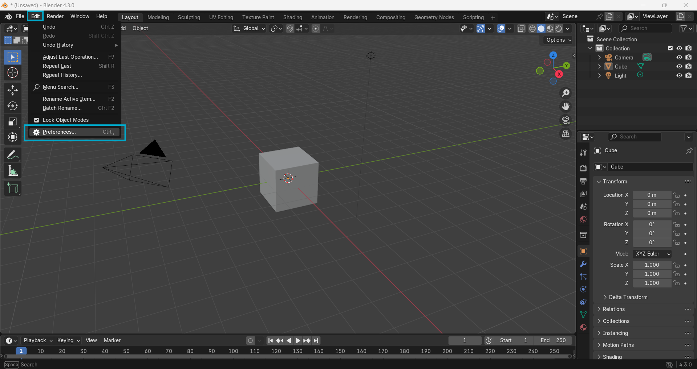
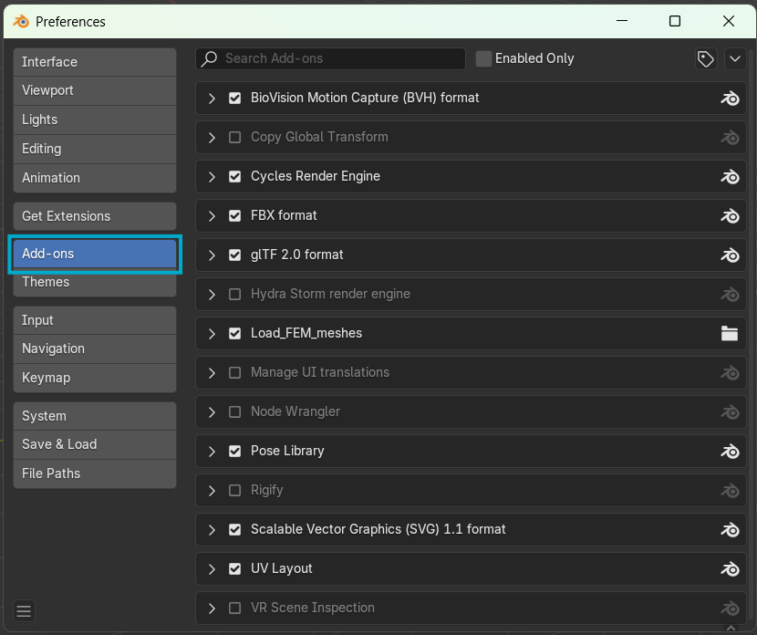
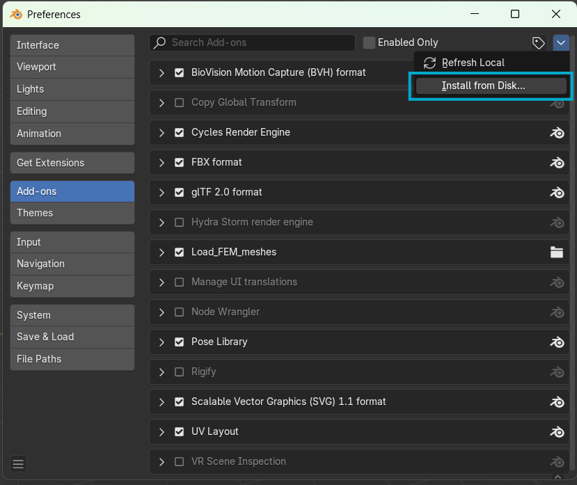
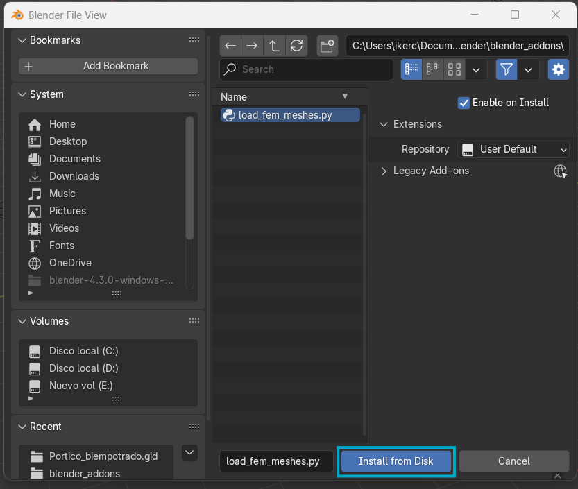
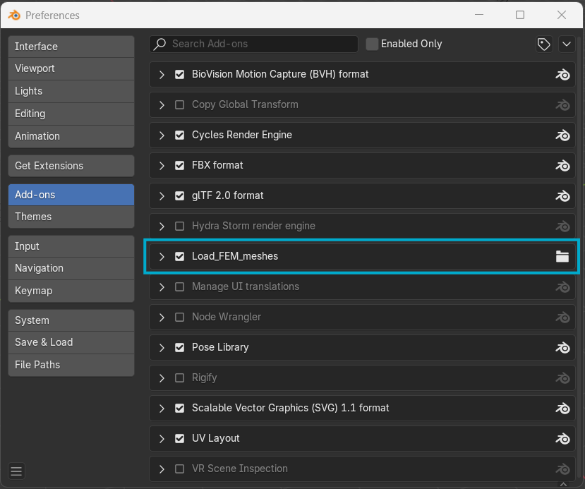
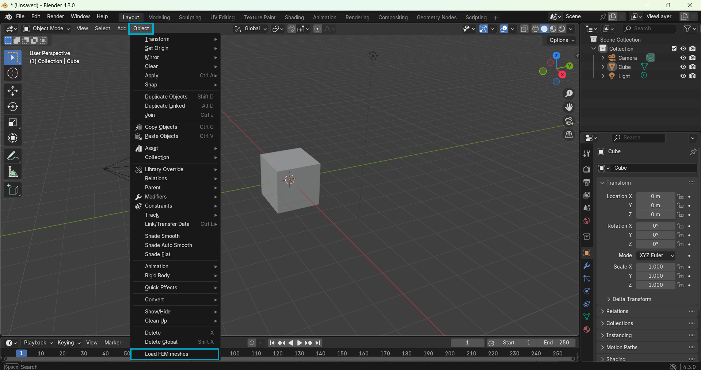
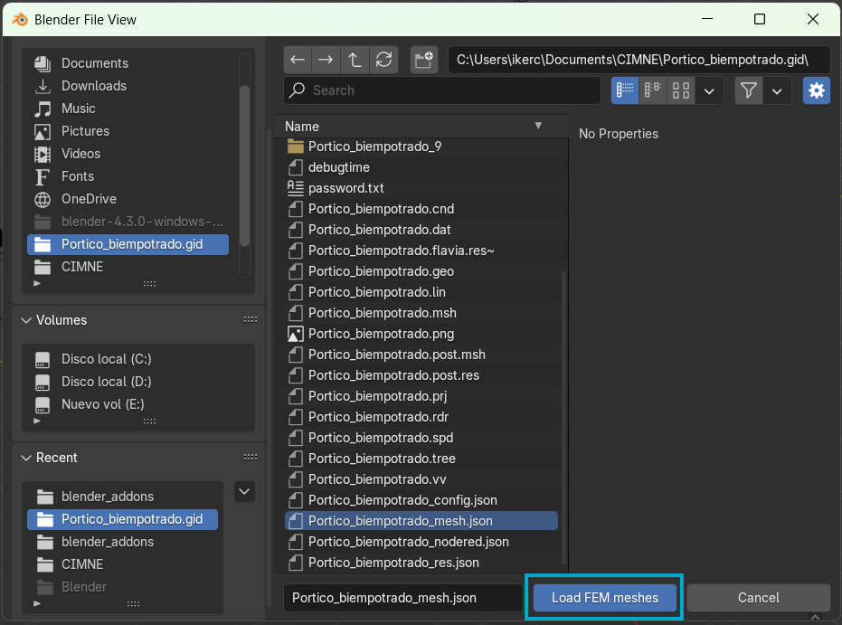
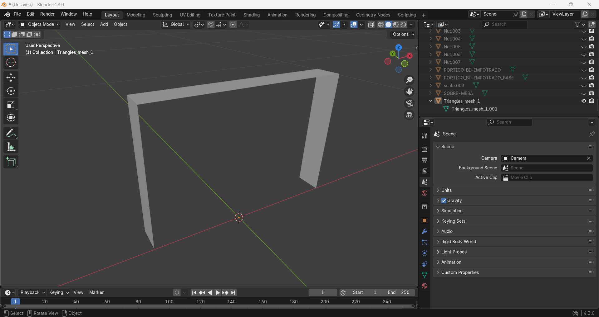

# Addon Load_FEM_meshes para Blender

## 1. Descripción General del Addon

### Información Básica
- **Nombre**: Load_FEM_meshes
- **Autor**: Daniel Di Capua
- **Categoría**: Object
- **Licencia**: Proyecto OSI4IoT

### Funcionalidades Principales

El addon **`load_fem_meshes.py`** es una herramienta diseñada para importar y visualizar mallas de elementos finitos en **Blender**. Este addon permite:

#### Características Clave:

1. **Importación de Archivos JSON**: 
   - Carga archivos JSON que contienen datos de mallas FEM.
   - Compatible con el formato generado por el convertidor **gid2json**.

2. **Creación Automática de Colecciones**:
   - Organiza automáticamente los objetos FEM en colecciones específicas.
   - Mantiene la estructura jerárquica del modelo.

3. **Procesamiento de Geometría**:
   - Convierte datos de nodos y elementos en mallas de Blender.
   - Soporta elementos triangulares.

4. **Integración con la Interfaz**:
   - Se integra en el menú Object de Blender.
   - Utiliza el sistema nativo de selección de archivos.

### Propósito en el Proyecto OSI4IoT

Este addon forma parte del pipeline de visualización del proyecto OSI4IoT, permitiendo:
- Visualización 3D de resultados de simulaciones estructurales.
- Inspección visual de mallas de elementos finitos.
- Herramienta fundamental para generar el **.glb** completo de los Gemelos Digitales.

## 2. Requisitos del Sistema

### Versión de Blender Compatible
- **Versión Mínima**: Blender 2.93.7 o superior.


### Requisitos del Sistema

#### Requisitos Mínimos:
- **Sistema Operativo**: Windows 10/11, macOS 10.15+, Linux Ubuntu 18.04+
- **RAM**: 4 GB mínimo (8 GB recomendado).
- **Espacio en Disco**: 50 MB para el addon + espacio para archivos JSON.
- **Python**: Incluido con Blender.

### Dependencias
- **Módulos Python**: json, os, pathlib (incluidos en Blender).
- **Módulos Blender**: bpy, bpy_extras (nativos de Blender).

## 3. Instrucciones de Instalación

### Instalación Manual 

#### Paso 1: Descargar el Addon
```bash
# Navegar a la carpeta blender_addons del directorio del proyecto
cd blender/blender_addons/

# El archivo load_fem_meshes.py está listo para usar
```

#### Paso 2: Instalar en Blender
1. **Abrir Blender**
2. **Ir a Preferences**:
   - Menú: `Edit > Preferences` (Windows/Linux)
   - Menú: `Blender > Preferences` (macOS)

   
   
3. **Navegar a Add-ons**:
   - Clic en la pestaña "Add-ons" en el panel izquierdo

   
   
4. **Instalar Addon**:
   - Clic en "Install..." en la parte superior derecha.

   

   - Navegar a la ubicación del archivo `load_fem_meshes.py`
   - Seleccionar el archivo y hacer clic en "Install Add-on"

   
   
5. **Activar el Addon**:
   - Buscar "Load_FEM_meshes" en la lista de addons
   - Marcar la casilla para activarlo
   - El addon aparecerá en la categoría "Object"

   

#### Paso 3: Importar malla FEM a Blender
1. **Ir a `Object > Load FEM meshes`**

   

2. En la ventana **Blender File View** seleccionar el archivo `{nombre}_mesh.json` generado por el convertidor **gid2json**.
3. Hacer clic en **`Load FEM meshes`** para importar la malla.

   

## 4. Guía de Uso

### Preparación de Datos

Antes de usar el addon, se necesita tener el archivo JSON de la malla FEM:

```bash
# Convertir archivos GiD a JSON usando gid2json
cd gid2json

node index.js ../ruta/al/proyecto.gid --pre-read-results
```

Esto generará archivos como:
- `proyecto_mesh.json` (geometría de la malla).
- `proyecto_res.json` (resultados de la simulación de elemetons finitos).

### Uso del Addon

#### Paso 1: Preparar la Escena
1. **Abrir Blender** con una escena nueva
2. **Eliminar objetos por defecto**:
   - Seleccionar cubo, luz, cámara
   - Presionar `Delete` o `X > Delete`

#### Paso 2: Importar Malla FEM
1. **Acceder al Importador de la Malla**:
   - Ir a `Object > Load FEM meshes`

2. **Seleccionar el Archivo**:
   - Se abrirá el navegador de archivos de Blender
   - Navegar a la ubicación del archivo `{nombre}_mesh.json`
   - Seleccionar el archivo y hacer clic en "Load FEM meshes"




## 6. Solución de Problemas

### Problema 1: Addon No Aparece en el Menú

**Síntomas**:
- El addon está instalado pero no aparece en Object menu
- Error en la consola de Blender

**Soluciones**:
1. **Verificar Activación**:
   - Ir a Preferences > Add-ons
   - Buscar "Load_FEM_meshes"
   - Asegurar que esté marcado

2. **Reiniciar Blender**:
   - Cerrar completamente Blender
   - Abrir nuevamente

3. **Verificar Versión de Blender**:
   ```python
   import bpy
   print(bpy.app.version)  # Debe ser >= (2, 93, 7)
   ```

3. **Regenerar Archivo JSON**:
   ```bash
   # Usar gid2json para regenerar
   node gid2json/index.js proyecto.gid --pre-read-results
   ```

### Problema 2: Geometría No Visible

**Síntomas**:
- El addon ejecuta sin errores.
- Los objetos aparecen en Outliner.
- No hay geometría visible en viewport.

**Soluciones**:
1. **Verificar Escala**:
   - Presionar `Numpad .` para enfocar objetos seleccionados.
   - Verificar que la geometría no esté muy pequeña o grande.

2. **Verificar Capas/Colecciones**:
   - Asegurar que la colección "Triangles_mesh" esté visible.
   - Verificar iconos de ojo en Outliner.


---

*Este addon es parte del ecosistema OSI4IoT y está diseñado específicamente para trabajar con datos de elementos finitos generados por el pipeline gid2json del proyecto.*