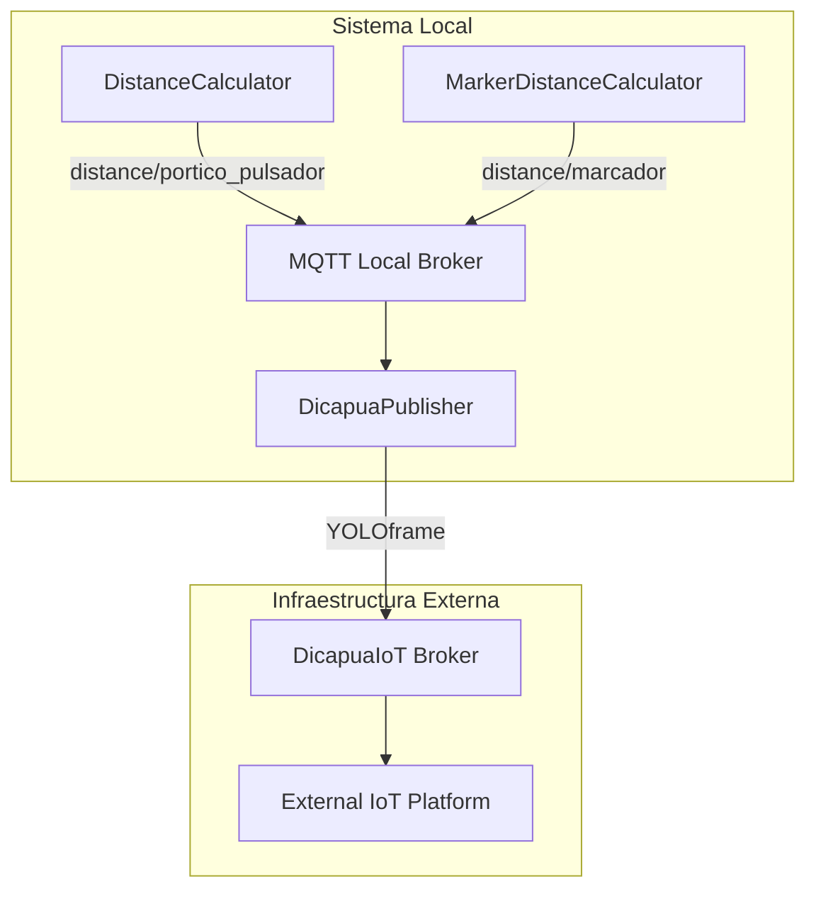

# Carpeta `mqtt/` - Comunicación y Telemetría

## Descripción General

La carpeta `mqtt/` implementa el sistema de comunicación del gemelo digital utilizando el protocolo MQTT (Message Queuing Telemetry Transport). Proporciona conectividad bidireccional entre el sistema local y la plataforma externa dicapuaiot.com (OSI4IoT), permitiendo la transmisión en tiempo real de los datos detectados mediante cámara, métricas de rendimiento y comandos de control.

## Arquitectura de Comunicación

### Componente Principal: `DicapuaPublisher`

La clase `DicapuaPublisher` implementa un patrón de comunicación dual que gestiona:

1. **Conexión Externa (DicapuaIoT)**: Comunicación con la plataforma IoT externa.
2. **Conexión Local**: Recepción de los datos calculados internamente por el sistema.
3. **Agregación de Datos**: Combinación y validación de múltiples fuentes.
4. **Reconexión Automática**: Mantenimiento robusto de conectividad.

### Diagrama de Arquitectura



## Protocolo MQTT y Principios de Comunicación

### 1. Fundamentos del Protocolo MQTT

MQTT es un protocolo de mensajería ligero basado en el patrón publish-subscribe:

**Modelo de Comunicación:**
```
Publisher → Broker → Subscriber(s)
```

**Características Clave:**
- **QoS (Quality of Service)**: Garantías de entrega de los datos enviados.
- **Retain**: Persistencia del último mensaje.
- **Clean Session**: Gestión de sesiones persistentes.
- **Keep Alive**: Mantenimiento de conexión.

### 2. Niveles de QoS Implementados

$$
\text{QoS 0: At most once} \rightarrow \text{Fire and forget}
$$
$$
\text{QoS 1: At least once} \rightarrow \text{Acknowledged delivery}
$$
$$
\text{QoS 2: Exactly once} \rightarrow \text{Assured delivery}
$$

### 3. Topología de Topics

#### Topics Locales (Recepción)
- `distance/marcador`: Datos del calculador de la clase marcador.
- `distance/portico_pulsador`: Datos del calculador pórtico-pulsador.

#### Topics Externos (Publicación)
- `YOLOframe`: Datos combinados hacia DicapuaIoT

## Implementación de Conectividad Dual

### 1. Cliente DicapuaIoT (Externo)

```python
def connect_dicapua_mqtt(self) -> mqtt_client.Client:
    """Conecta al broker DicapuaIoT externo"""
    client = mqtt_client.Client(
        client_id=self.config.client_id + "_dicapua", 
        clean_session=False
    )
    
    # Configuración SSL/TLS o autenticación básica
    if self.config.connectCerts:
        client.tls_set(
            ca_certs=self.config.certs["ca_certs"],
            certfile=self.config.certs["certfile"],
            keyfile=self.config.certs["keyfile"]
        )
        port = 8883  # Puerto seguro
    else:
        client.username_pw_set(self.config.username, self.config.password)
        port = 1883  # Puerto estándar
```

#### Seguridad y Autenticación

**Autenticación por Certificados (TLS):**
- Certificado de Autoridad Certificadora (CA)
- Certificado del cliente
- Clave privada del cliente

**Autenticación Básica:**
- Usuario y contraseña


### 2. Cliente MQTT Local

```python
def connect_local_mqtt(self) -> mqtt_client.Client:
    """Conecta al broker MQTT local para recibir datos de calculadores"""
    client = mqtt_client.Client(
        client_id=self.config.client_id + "_local", 
        clean_session=True
    )
    
    # Suscripción automática a topics de interés
    def on_local_connect(client, userdata, flags, rc):
        if rc == 0:
            client.subscribe(self.marker_topic)
            client.subscribe(self.portico_topic)
```

## Agregación y Procesamiento de Datos

### 1. Recepción de Datos Locales

El sistema recibe datos de múltiples calculadores:

```python
def on_local_message(self, client, userdata, msg):
    """Callback para mensajes del broker local"""
    topic = msg.topic
    payload = json.loads(msg.payload.decode())
    
    if topic == "distance/portico_pulsador":
        self.last_portico_data = {
            'distance_cm': payload.get('distance_cm'),
            'timestamp': payload.get('timestamp'),
            'source': 'portico_calculator'
        }
    elif topic == "distance/marcador":
        self.last_marker_data = {
            'distance_cm': payload.get('distance_cm'),
            'timestamp': payload.get('timestamp'),
            'source': 'marker_calculator'
        }
```

### 2. Combinación de Datos

Los datos de múltiples fuentes se combinan en un payload unificado:

```python
def _send_combined_data_to_dicapuaiot(self):
    """Envía datos combinados de marcador y pórtico a DicapuaIoT"""
    combined_payload = {
        "timestamp": datetime.datetime.now().strftime("%Y-%m-%dT%H:%M:%S.%fZ"),
        "markerZ": self.last_marker_data['distance_cm'],
        "buttonX": self.last_portico_data['distance_cm'],
        "marker": self.last_marker_data['distance_cm'] * 0.91 * 10
    }
```

### 3. Validación de Datos

Implementa validación robusta antes de la transmisión:

```python
def _validate_distance_data(self, payload: Dict[str, Any]) -> bool:
    """Valida que los datos de distancia estén en rangos válidos"""
    marker_z = payload.get('markerZ')
    button_x = payload.get('buttonX')
    
    # Validaciones de tipo y rango
    if not isinstance(marker_z, (int, float)) or not isinstance(button_x, (int, float)):
        return False
        
    # Validar rangos físicamente posibles
    if not (0 <= marker_z < 1000) or not (0 <= button_x < 1000):
        return False
        
    return True
```

## Gestión de Reconexión Automática

### 1. Algoritmo de Reconexión Exponencial

Implementa backoff exponencial para reconexiones:

$$
delay_n = \min(delay_{initial} \times 2^n, delay_{max})
$$

Donde:
- $delay_{initial} = 1$ segundo
- $delay_{max} = 60$ segundos
- $n$ = número de intentos fallidos

### 2. Detección de Desconexión

```python
def on_dicapua_disconnect(client, userdata, rc):
    """Callback para desconexión de DicapuaIoT"""
    self.dicapua_connected = False
    
    if rc != 0:  # Desconexión inesperada
        disconnect_codes = {
            1: "Versión de protocolo no aceptable",
            2: "Identificador rechazado",
            3: "Servidor no disponible",
            4: "Usuario/contraseña malformados",
            5: "No autorizado",
            7: "Error de red/conexión",
            8: "Timeout de conexión"
        }
        
        if self.should_reconnect:
            self._schedule_reconnect()
```

### 3. Threading para Reconexión No Bloqueante

```python
def _schedule_reconnect(self):
    """Programa reconexión en hilo separado"""
    if not self.reconnect_thread or not self.reconnect_thread.is_alive():
        self.reconnect_thread = threading.Thread(
            target=self._reconnect_loop,
            daemon=True
        )
        self.reconnect_thread.start()
```

## Control de Flujo y Optimización

### 1. Throttling de Publicaciones

Implementa control de velocidad para evitar saturación:

```python
def publish_distance(self, distancia: float) -> bool:
    """Publica distancia con control de throttling"""
    current_time = time.time()
    if current_time - self.last_publish_time < self.publish_threshold:
        return False  # Demasiado pronto para publicar
    
    # Proceder con publicación
    self.last_publish_time = current_time
```

### 2. Reintentos con Backoff

```python
def _publish_with_retry(self, topic: str, message: str, retries: int = 3) -> bool:
    """Publica mensaje con reintentos automáticos"""
    for attempt in range(retries):
        try:
            result = self.dicapua_client.publish(topic, message)
            if result.rc == mqtt_client.MQTT_ERR_SUCCESS:
                return True
        except Exception as e:
            if attempt < retries - 1:
                time.sleep(2 ** attempt)  # Backoff exponencial
            else:
                self.logger.error(f"Error después de {retries} intentos: {e}")
    return False
```

## Formato de Datos y Serialización

### 1. Estructura de Payload DicapuaIoT

```json
{
    "timestamp": "2024-01-15T10:30:45.123456Z",
    "markerZ": 2, //cm
    "buttonX": 20, //cm
    "marker": 10 //Newtons (N)
}
```

### 2. Generación de Timestamps UTC

```python
def generate_utc_timestamp() -> str:
    """Genera timestamp UTC con microsegundos"""
    now_utc = datetime.datetime.now()
    mlsec = repr(now_utc).split(",")[-1][-7:-1].replace(" ", "0")
    return now_utc.strftime("%Y-%m-%dT%H:%M:%S.{}Z".format(mlsec))
```

### 3. Transformación de Datos

Aplicar transformaciones de los datos obtenidos para calcular la fuerza aplicada en Newtons (N):

$$
marker_{force} = markerZ \times 0.91 \times 10
$$

Esta transformación representa:
- Constante de elasticidad: 0.91 (N/cm)
- Conversión de unidades (×10)
- markerZ: Distancia detectada en el marcador (cm).


## Monitoreo y Diagnóstico

### 1. Estado de Conexiones

```python
def get_connection_status(self) -> Dict[str, Any]:
    """Retorna estado completo de conexiones"""
    return {
        'dicapua_connected': self.dicapua_connected,
        'local_connected': self.local_connected,
        'dicapua_broker': self.config.broker,
        'local_broker': self.local_broker,
        'client_id': self.config.client_id,
        'use_certs': self.config.connectCerts,
        'last_marker_time': self.last_marker_time,
        'last_portico_time': self.last_portico_time
    }
```

### 2. Logging Estructurado

Implementa logging detallado para diagnóstico:

```python
# Niveles de logging
self.logger.debug("Mensaje de depuración detallado")
self.logger.info("Información general de operación")
self.logger.warning("Advertencia de condición anómala")
self.logger.error("Error que requiere atención")
```

### 3. Métricas de Rendimiento

- **Latencia de publicación**: Tiempo entre generación y envío
- **Tasa de éxito**: Porcentaje de mensajes entregados exitosamente
- **Tiempo de reconexión**: Duración de interrupciones de servicio
- **Throughput**: Mensajes por segundo procesados

## Configuración y Personalización

### 1. Archivo de Configuración

```json
{
    "broker": "dicapuaiot.example.com",
    "client_id": "gantry_digital_twin",
    "username": "device_user",
    "password": "secure_password",
    "connectCerts": true,
    "certs": {
        "ca_certs": "path/to/ca.crt",
        "certfile": "path/to/client.crt",
        "keyfile": "path/to/client.key"
    },
    "topic": {
        "publish": {
            "YOLOframe": "sensors/gantry/yolo_data"
        }
    }
}
```

### 2. Parámetros de Conexión

- **Keep Alive**: 300 segundos (5 minutos)
- **Clean Session**: False para DicapuaIoT, True para local
- **Publish Threshold**: 100ms mínimo entre publicaciones
- **Reconnect Delay**: 1-60 segundos con backoff exponencial

## Patrones de Diseño Implementados

### 1. Patrón Publisher-Subscriber
Separación clara entre productores y consumidores de datos.

### 2. Patrón Observer
Notificación automática de cambios de estado de conexión.

### 3. Patrón Strategy
Diferentes estrategias de autenticación (certificados vs. usuario/contraseña).

### 4. Patrón Circuit Breaker
Protección contra fallos en cascada mediante reconexión controlada.

## Dependencias Técnicas

- **paho-mqtt**: Cliente MQTT oficial de Python.
- **ssl/tls**: Módulos de seguridad de Python.
- **json**: Serialización de datos.
- **threading**: Concurrencia y operaciones asíncronas.
- **datetime**: Manejo de timestamps y zonas horarias.
- **logging**: Sistema de logging estructurado.


