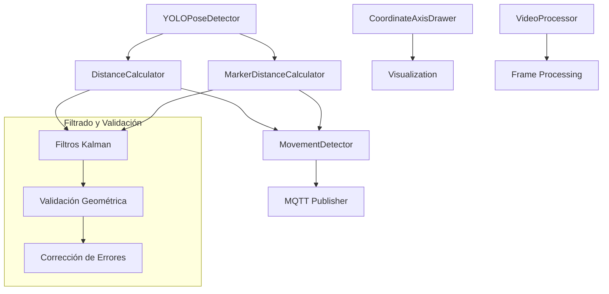
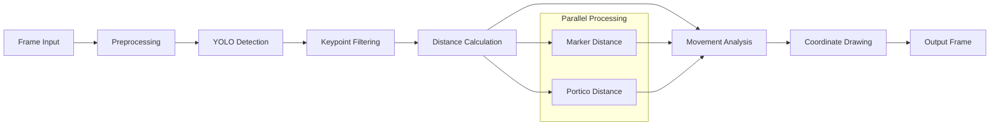

# Carpeta `postprocess/` - Procesamiento y Análisis de Datos

## Descripción General

La carpeta `postprocess/` contiene los módulos de procesamiento y análisis de datos del sistema de gemelo digital, implementando algoritmos matemáticos y físicos para el análisis de detecciones, cálculo de distancias, filtrado de ruido, detección de movimiento y transformaciones geométricas. Esta capa actúa como el cerebro analítico del sistema, convirtiendo datos brutos de detección en información procesada y validada.

## Arquitectura del Sistema de Procesamiento

### Componentes Principales



### Flujo de Procesamiento

1. **Recepción de Detecciones**: Datos brutos de YOLO
2. **Filtrado Kalman**: Reducción de ruido en keypoints
3. **Validación Geométrica**: Verificación de coherencia espacial
4. **Cálculo de Distancias**: Métricas euclidianas y transformaciones
5. **Detección de Movimiento**: Análisis temporal y filtrado inteligente
6. **Comunicación**: Envío de datos procesados vía MQTT

## 1. Calculador de Distancias (`distance_calculator.py`)

### Funcionalidad Principal

Implementa el cálculo de distancias entre el pulsador y el pórtico con calibración automática, filtrado Kalman y corrección geométrica.

### Algoritmos Matemáticos Implementados

#### 1.1 Distancia Euclidiana

La distancia fundamental entre dos puntos se calcula usando:

```math
d = \sqrt{(x_2 - x_1)^2 + (y_2 - y_1)^2}
```

Donde $(x_1, y_1)$ y $(x_2, y_2)$ son las coordenadas de los puntos en el espacio de la imagen.

#### 1.2 Calibración Automática

El sistema utiliza la distancia conocida (modelo real) entre keypoints verticales C y B de la clase pórtico (21 cm) para calibrar automáticamente:

```math
\text{pixels\_per\_cm} = \frac{d_{pixels}(C, B)}{21.0 \text{ cm}}
```

**Calibración con Promedio Ponderado:**

```math
\text{calibration}_{final} = \frac{\sum_{i=1}^{n} w_i \cdot c_i}{\sum_{i=1}^{n} w_i}
```

Donde:
- $n$ es el número de calibraciones.
- $w_i = e^{-\alpha(n-i)}$ es el peso asignado a la calibración i.
  - Si $i$ está muy lejos de n (es antigua) → peso bajo.
  - Si $i$ es cercana a n (es reciente) → peso alto.
- $c_i$ es la calibración individual para la iteración $i$.

#### 1.3 Filtros Kalman para Keypoints

**Modelo de Estado:**

```math
\mathbf{x}_k = \begin{bmatrix} x \\ y \\ \dot{x} \\ \dot{y} \end{bmatrix}_k
```

Significa que en cada instante $k$ se están modelando 4 variables:  
- $x$: posición horizontal del keypoint en la imagen (en píxeles).
- $y$: posición vertical del keypoint en la imagen (en píxeles).
- $\dot{x}$: velocidad horizontal del keypoint (en píxeles por frame).
- $\dot{y}$: velocidad vertical del keypoint (en píxeles por frame).

Por lo tanto, no solo se almacena la posción del keypoint, sino también la velocidad estimada en cada eje.

**Implementación Práctica:**

```python
def _init_kalman_filter(self, keypoint_id: str) -> cv2.KalmanFilter:
    """
    Inicializa un filtro Kalman para un keypoint específico.
    """
    kalman = cv2.KalmanFilter(4, 2)
    # Matriz de observación H
    kalman.measurementMatrix = np.array([[1, 0, 0, 0],
                                       [0, 1, 0, 0]], np.float32)
    # Matriz de transición F
    kalman.transitionMatrix = np.array([[1, 0, 1, 0],
                                      [0, 1, 0, 1],
                                      [0, 0, 1, 0],
                                      [0, 0, 0, 1]], np.float32)
    # Ruido de proceso Q = 0.03 * I_4
    kalman.processNoiseCov = 0.03 * np.eye(4, dtype=np.float32)
    # Ruido de medición R = 0.1 * I_2
    kalman.measurementNoiseCov = 0.1 * np.eye(2, dtype=np.float32)
    # Covarianza inicial P_0 = 0.1 * I_4
    kalman.errorCovPost = 0.1 * np.eye(4, dtype=np.float32)
    return kalman

def _filter_keypoint(self, keypoint: Tuple[float, float, float], keypoint_id: str) -> Tuple[float, float]:
    """
    Aplica filtrado Kalman a un keypoint para reducir ruido.
    """
    if keypoint_id not in self.kalman_filters:
        self.kalman_filters[keypoint_id] = self._init_kalman_filter(keypoint_id)
        # Inicializar estado [x, y, vx, vy]
        self.kalman_filters[keypoint_id].statePre = np.array([keypoint[0], keypoint[1], 0, 0], dtype=np.float32)
    
    kalman = self.kalman_filters[keypoint_id]
    
    # Predicción: x̂_{k|k-1} = F * x̂_{k-1|k-1}
    prediction = kalman.predict()
    
    # Actualización con medición z_k
    measurement = np.array([[keypoint[0]], [keypoint[1]]], dtype=np.float32)
    kalman.correct(measurement)
    
    return float(prediction[0]), float(prediction[1])
```

**Matrices del Sistema:**

**Matriz de Transición:**

```math
\mathbf{F} = \begin{bmatrix}
1 & 0 & 1 & 0 \\
0 & 1 & 0 & 1 \\
0 & 0 & 1 & 0 \\
0 & 0 & 0 & 1
\end{bmatrix}
```

La matriz de transición ($\mathbf{F}$)describe cómo evoluciona el estado del sistema a lo largo del tiempo. En este caso, el estado se define como $(x, y, \dot{x}, \dot{y})$.

Es decir, dicha matriz modela un movimiento constante. Si no llegara nueva medición, el filtro predice que el punto sigue en la misma dirección y con la misma velocidad.

**Matriz de Observación:**

```math
\mathbf{H} = \begin{bmatrix}
1 & 0 & 0 & 0 \\
0 & 1 & 0 & 0
\end{bmatrix}
```

La matriz de observación ($\mathbf{H}$) describe cómo se relaciona el estado del sistema con las mediciones observables. En este caso, solo se observa la posición $(x, y)$ del keypoint, por lo que la matriz es:

- La fila 1 indica que la medición de $x$ está relacionada con la posición $x$ del estado.
- La fila 2 indica que la medición de $y$ está relacionada con la posición $y$ del estado.

#### 1.4 Validación Geométrica del Rectángulo

Verifica que los keypoints del pórtico mantengan las proporciones correctas:

```math
\text{ratio} = \frac{d(D,C)}{d(C,B)} \approx \frac{30.0 \text{ cm}}{21.0 \text{ cm}} = 1.429
```

*Donde:*
- $d(D,C)$ es la distancia real conocida entre los keypoints $D$ y $C$.
- $d(C,B)$ es la distancia real conocida entre los keypoints $C$ y $B$.

**Implementación Práctica:**

```python
def _validate_rectangle_geometry(self, keypoints: List[Tuple[float, float, float]]) -> bool:
    """
    Valida que los keypoints formen un rectángulo con las dimensiones esperadas.
    """
    if len(keypoints) < 4:
        return False
    
    try:
        # Extraer puntos A, B, C, D con confianza > 0.5
        points = [(kp[0], kp[1]) for kp in keypoints[:4] if kp[2] > 0.5]
        if len(points) < 4:
            return False
        
        # Calcular distancias euclidianas
        dist_dc = math.sqrt((points[3][0] - points[2][0])**2 + (points[3][1] - points[2][1])**2)
        dist_cb = math.sqrt((points[2][0] - points[1][0])**2 + (points[2][1] - points[1][1])**2)
        
        # Verificar proporciones 
        if dist_dc > 0 and dist_cb > 0:
            ratio = dist_dc / dist_cb
            expected_ratio = self.portico_width_cm / self.portico_height_cm  # 30.0 / 21.0 = 1.429
            error = abs(ratio - expected_ratio) / expected_ratio
            return error < self.error_threshold  # 0.15
            
    except (IndexError, ZeroDivisionError):
        pass
        
    return False
```

**Criterio de Validación:**
```math
\text{error} = \frac{|\text{ratio}_{observed} - \text{ratio}_{expected}|}{\text{ratio}_{expected}} < 0.15
```

#### 1.5 Corrección Geométrica por Mínimos Cuadrados

Cuando la geometría no es válida, se aplica optimización:

**Función Objetivo:**
```math
\min_{\mathbf{p}} \sum_{i=1}^{4} w_i \|\mathbf{r}_i - \mathbf{r}_i^{ideal}(\mathbf{p})\|^2
```

La función objetivo minimiza la suma de los errores cuadráticos ponderados entre los puntos detectados $\mathbf{r}_i$ y los puntos ideales $\mathbf{r}_i^{ideal}(\mathbf{p})$. Ajusta los parámetros $\mathbf{p}$ para que los puntos ideales generados por el modelo se aproximen lo más posible a los puntos detectados, teniendo en cuenta la importancia relativa de cada punto mediante los pesos $w_i$.

Donde:
- $\mathbf{r}_i$ representa la posición detectada del keypoint $i$ en la imagen.
- $\mathbf{r}_i^{ideal}(\mathbf{p})$ es la posición ideal del keypoint $i$ dada la geometría del rectángulo.
- $w_i$ es el peso asignado al keypoint $i$.
- $\mathbf{p} = [c_x, c_y, w, h, \theta]$ son los parámetros del rectángulo.

**Implementación Práctica:**

```python
def _correct_keypoints_geometry(self, keypoints: List[Tuple[float, float, float]]) -> List[Tuple[float, float, float]]:
    """
    Corrige la geometría de los keypoints usando mínimos cuadrados.
    """
    if len(keypoints) < 4:
        return keypoints
    
    try:
        # Extraer puntos válidos y sus confianzas
        points = np.array([(kp[0], kp[1]) for kp in keypoints[:4] if kp[2] > 0.5])
        confidences = [kp[2] for kp in keypoints[:4] if kp[2] > 0.5]
        
        if len(points) < 4:
            return keypoints
        
        # Función objetivo para optimización
        def objective(params):
            # params: [center_x, center_y, width, height, angle]
            cx, cy, w, h, angle = params
            
            # Calcular posiciones ideales del rectángulo
            cos_a, sin_a = math.cos(angle), math.sin(angle)
            ideal_points = np.array([
                [cx - w/2*cos_a + h/2*sin_a, cy - w/2*sin_a - h/2*cos_a],  # A
                [cx - w/2*cos_a - h/2*sin_a, cy - w/2*sin_a + h/2*cos_a],  # B
                [cx + w/2*cos_a - h/2*sin_a, cy + w/2*sin_a + h/2*cos_a],  # C
                [cx + w/2*cos_a + h/2*sin_a, cy + w/2*sin_a - h/2*cos_a]   # D
            ])
            
            # Calcular error ponderado por confianza
            errors = []
            for i, (point, conf) in enumerate(zip(points, confidences)):
                error = np.linalg.norm(point - ideal_points[i]) * conf
                errors.append(error)
            
            return errors
        
        # Estimación inicial basada en el centroide
        center = np.mean(points, axis=0)
        initial_params = [center[0], center[1], 100, 70, 0]  # [cx, cy, w, h, θ]
        
        # Optimización usando Levenberg-Marquardt
        result = least_squares(objective, initial_params)
        
        if result.success:
            cx, cy, w, h, angle = result.x
            cos_a, sin_a = math.cos(angle), math.sin(angle)
            
            # Generar puntos corregidos
            corrected_points = [
                (cx - w/2*cos_a + h/2*sin_a, cy - w/2*sin_a - h/2*cos_a, keypoints[0][2]),  # A
                (cx - w/2*cos_a - h/2*sin_a, cy - w/2*sin_a + h/2*cos_a, keypoints[1][2]),  # B
                (cx + w/2*cos_a - h/2*sin_a, cy + w/2*sin_a + h/2*cos_a, keypoints[2][2]),  # C
                (cx + w/2*cos_a + h/2*sin_a, cy + w/2*sin_a - h/2*cos_a, keypoints[3][2])   # D
            ]
            
            return corrected_points + keypoints[4:]  # Mantener keypoints adicionales
            
    except Exception:
        pass
        
    return keypoints
```

**Posiciones Ideales del Rectángulo:**

```math
\mathbf{r}_A = \begin{bmatrix} c_x - \frac{w}{2}\cos\theta + \frac{h}{2}\sin\theta \\ c_y - \frac{w}{2}\sin\theta - \frac{h}{2}\cos\theta \end{bmatrix}
```

Dicha matriz $\mathbf{r}_A$ define la posición ideal del vértice A de un rectángulo en coordenadas 2D. 

Donde: 
- $c_x$ y $c_y$ son las coordenadas del centro del rectángulo.
- $w$ y $h$ son el ancho y alto del rectángulo.
- $\theta$ es el ángulo de rotación del rectángulo en radianes (respecto al eje x).

### Implementación de Filtrado Temporal

#### Suavizado Exponencial

```math
\mathbf{p}_{smooth} = \frac{\sum_{i=1}^{n} e^{-\alpha(n-i)} \mathbf{p}_i}{\sum_{i=1}^{n} e^{-\alpha(n-i)}}
```

Se trata de un filtro temporal para suavizar los parámetros $\mathbf{p}$ del rectángulo. 

Donde: 
- $\alpha$ es el factor de suavizado (0 < $\alpha$ < 1).
- $n$ es el número de muestras.
- $\mathbf{p}_i$ son los parámetros del rectángulo en la muestra $i$.

## 2. Calculador de Distancias de Marcador (`marker_distance_calculator.py`)

### Funcionalidad Específica

Calcula la distancia entre el punto medio superior de la bounding box de la clase marcador y el centroide de sus keypoints.

### Algoritmos Implementados

#### 2.1 Cálculo del Centroide de Keypoints

```math
\mathbf{c} = \frac{1}{n} \sum_{i=1}^{n} \mathbf{k}_i
```

Donde:
- $\mathbf{k}_i$ son los keypoints válidos (confianza > 0.5).
```math
\mathbf{k}_i = \begin{bmatrix} x_i \\ y_i \\ c_i\end{bmatrix}
```
- $n$ es el número de keypoints válidos.

#### 2.2 Punto Medio Superior de la Bounding Box


```math
\mathbf{p}_{top} = \begin{bmatrix} \frac{x_1 + x_2}{2} \\ y_1 \end{bmatrix}
```

Donde $(x_1, y_1, x_2, y_2)$ define la bounding box.

#### 2.3 Corrección de Calibración

Se aplica un factor de corrección específico para el marcador:

```math
d_{corrected} = \max(0, d_{raw} - 0.9 \text{ cm})
```

Dicho ajuste compensa el muelle provisional del sistema mecánico.

## 3. Detector de Movimiento (`movement_detector.py`)

### Funcionalidad Avanzada

Implementa filtrado inteligente para evitar transmisiones MQTT innecesarias, analizando patrones de movimiento real vs. ruido de detección.

### Algoritmos de Análisis Temporal

#### 3.1 Cálculo de Velocidad

**Velocidad Instantánea:**

La siguiente ecuación permite calcular cuánto se ha movido el punto entre dos frames:

```math
v_i = \frac{\|\mathbf{p}_{i+1} - \mathbf{p}_i\|}{t_{i+1} - t_i}
```

Donde:
- $\mathbf{p}_{i+1}$ y $\mathbf{p}_i$ son las posiciones del punto en los frames $i+1$ e $i$, respectivamente.
- $t_{i+1}$ y $t_i$ son los tiempos correspondientes a los frames $i+1$ y $i$, respectivamente.

**Velocidad Promedio en Ventana Temporal:**

```math
\bar{v} = \frac{1}{n-1} \sum_{i=1}^{n-1} v_i
```

- Se promedian las velocidades instantáneas de los últimos $n$ frames.
- Esto suaviza los picos y da una medida más estable del movimiento.
#### 3.2 Análisis de Estabilidad de Posición

**Desviación Estándar de Posiciones:**

```math
\sigma_{pos} = \sqrt{\frac{1}{n} \sum_{i=1}^{n} \|\mathbf{p}_i - \bar{\mathbf{p}}\|^2}
```

Donde: 
- $\mathbf{p}_i$: posiciones observadas en los últimos $n$ frames.
- $\bar{\mathbf{p}}$: posición promedio.
- $\sigma_{pos}$: desviación estándar.
  - Si $\sigma_{pos}$ es muy baja → el punto está estable (no se mueve realmente, solo vibra por ruido de la detección).
  - Si $\sigma_{pos}$ es alta → el objeto sí está moviéndose.


**Implementación Práctica:**

```python
def is_position_stable(self, positions: Deque[Tuple[float, float, float]]) -> bool:
    """
    Verifica si la posición es estable (sin movimiento significativo).
    
    Args:
        positions: Deque de posiciones
        
    Returns:
        True si la posición es estable
    """
    if len(positions) < self.position_stability_frames:
        return False
    
    # Tomar las últimas posiciones
    recent_positions = list(positions)[-self.position_stability_frames:]
    
    # Calcular varianza de posiciones
    x_coords = [pos[0] for pos in recent_positions]
    y_coords = [pos[1] for pos in recent_positions]
    
    x_variance = np.var(x_coords)
    y_variance = np.var(y_coords)
    
    # Considerar estable si la varianza es baja
    return (x_variance < self.position_noise_threshold**2 and 
            y_variance < self.position_noise_threshold**2)

def calculate_velocity(self, positions: Deque[Tuple[float, float, float]]) -> float:
    """
    Calcula la velocidad promedio en píxeles por segundo.
    
    Args:
        positions: Deque de posiciones (x, y, timestamp)
        
    Returns:
        Velocidad promedio en px/s
    """
    if len(positions) < 2:
        return 0.0
    
    current_time = time.time()
    recent_positions = [
        pos for pos in positions 
        if current_time - pos[2] <= self.temporal_window_seconds
    ]
    
    if len(recent_positions) < 2:
        return 0.0
    
    # Calcular velocidades entre posiciones consecutivas
    velocities = []
    for i in range(1, len(recent_positions)):
        pos1 = recent_positions[i-1]
        pos2 = recent_positions[i]
        
        distance = math.sqrt((pos2[0] - pos1[0])**2 + (pos2[1] - pos1[1])**2)
        time_diff = pos2[2] - pos1[2]
        
        if time_diff > 0:
            velocity = distance / time_diff
            velocities.append(velocity)
    
    return np.mean(velocities) if velocities else 0.0
```

**Criterio de Estabilidad:**

```math
\text{stable} = (\sigma_{pos} < \sigma_{threshold}) \land (\bar{v} < v_{threshold})
```

#### 3.3 Filtros de Movimiento

**Filtro de Umbral de Distancia:**

```math
\text{send} = |d_{current} - d_{last}| > \Delta d_{threshold}
```

Donde:
- $d_{current}$: posición/medida actual.
- $d_{last}$: posición/medida anterior enviada.
- $\Delta d_{threshold}$: cambio mínimo de distancia aceptable.
  - Si $|d_{current} - d_{last}| > \Delta d_{threshold}$ → el cambio es significativo.
  - Si $|d_{current} - d_{last}| \leq \Delta d_{threshold}$ → el cambio es mínimo.

Es decir, solo se envía si la diferencia supera un umbral.

**Filtro de Velocidad:**

```math
\text{send} = \bar{v} > v_{threshold}
```

Donde: 
- $\bar{v}$: velocidad promedio en la ventana de tiempo.
- $v_{threshold}$: velocidad mínima significativa.
  - Si $\bar{v} > v_{threshold}$ → el objeto está moviéndose.
  - Si $\bar{v} \leq v_{threshold}$ → el objeto está quieto.

Por lo tanto, si el objeto se mueve más rápido de lo esperado, se considera movimiento real → luego, se envía.

**Filtro Temporal:**

```math
\text{send} = (t_{current} - t_{last\_send}) > \Delta t_{min}
```

Donde: 
- $t_{current}$: tiempo actual.
- $t_{last\_send}$: último instante en que se mandó un mensaje.
- $\Delta t_{min}$: intervalo mínimo entre mensajes.

Se evita mandar mensajes demasiado seguido.

#### 3.4 Algoritmo de Decisión Combinado

```math
\text{should\_send} = \bigwedge_{i} \text{filter}_i \land \text{movement\_detected}
```

**Implementación Práctica:**

```python
def should_send_distance(self, current_distance: float) -> bool:
    """
    Determina si se debe enviar la distancia actual por MQTT.
    
    Args:
        current_distance: Distancia actual en centímetros
        
    Returns:
        True si se debe enviar la distancia
    """
    self.total_distance_calculations += 1
    current_time = time.time()
    
    if not self.enable_movement_detection:
        # Si la detección de movimiento está deshabilitada, enviar siempre
        return True
    
    # 1. Verificar umbral de distancia
    if self.last_sent_distance is not None:
        distance_change = abs(current_distance - self.last_sent_distance)
        if distance_change < self.distance_threshold_cm:
            self.filtered_by_distance_threshold += 1
            return False
    
    # 2. Verificar velocidad de cambio de distancia
    if self.enable_velocity_filter:
        distance_velocity = self.calculate_distance_velocity()
        if distance_velocity < self.velocity_threshold_cm_s:
            self.filtered_by_velocity += 1
            return False
    
    # 3. Verificar estabilidad de posiciones
    if self.enable_stability_filter:
        pulsador_stable = self.is_position_stable(self.pulsador_positions)
        portico_stable = self.is_position_stable(self.portico_positions)
        
        if pulsador_stable and portico_stable:
            self.stable_position_count += 1
            self.filtered_by_stability += 1
            return False
        else:
            self.stable_position_count = 0
    
    # 4. Verificar movimiento relativo
    if self.enable_relative_movement_filter:
        if not self.detect_relative_movement():
            self.filtered_by_relative_movement += 1
            return False
    
    # 5. Filtro de ruido temporal
    if self.enable_temporal_filter:
        min_time_seconds = self.min_time_between_sends_ms / 1000.0
        if current_time - self.last_movement_time < min_time_seconds:
            self.filtered_by_temporal += 1
            return False
    
    # Todas las verificaciones pasaron, enviar distancia
    self.last_movement_time = current_time
    self.last_sent_distance = current_distance
    self.movement_detected = True
    self.sent_distances += 1
    
    return True
```

Donde cada filtro puede ser habilitado/deshabilitado dinámicamente mediante la configuración.

### Métricas de Rendimiento

El sistema mantiene estadísticas de filtrado:

- **Tasa de Filtrado**: $\frac{\text{mensajes filtrados}}{\text{total de cálculos}}$
- **Eficiencia de Red**: Reducción de tráfico MQTT
- **Precisión de Detección**: Verdaderos positivos vs. falsos positivos

## 4. Dibujador de Ejes de Coordenadas (`coordinate_axis_drawer.py`)

### Sistema de Coordenadas Visual

Implementa un sistema de referencia visual para orientación espacial en las imágenes.

### Transformaciones Geométricas

#### 4.1 Cálculo de Posición de Origen

**Esquina Inferior Derecha (por defecto):**

```math
\mathbf{o} = \begin{bmatrix} w - m - \frac{s}{2} \\ h - m - \frac{s}{2} \end{bmatrix}
```

Donde $w$ y $h$ son las dimensiones de la imagen, $m$ es el margen y $s$ es el tamaño del sistema.

#### 4.2 Vectores de Ejes

**Eje X (positivo hacia la derecha):**

```math
\mathbf{v}_x = \begin{bmatrix} \frac{s}{2} \\ 0 \end{bmatrix}
```

**Eje Z (positivo hacia abajo):**

```math
\mathbf{v}_z = \begin{bmatrix} 0 \\ \frac{s}{2} \end{bmatrix}
```

#### 4.3 Generación de Flechas

**Cálculo del Ángulo:**

```math
\theta = \arctan2(\Delta y, \Delta x)
```

**Implementación Práctica:**

```python
def _draw_axis_arrow(self, frame: np.ndarray, start: Tuple[int, int], 
                    end: Tuple[int, int], color: Tuple[int, int, int]) -> None:
    """
    Dibuja una flecha para representar un eje.
    
    Args:
        frame: Frame donde dibujar
        start: Punto de inicio de la flecha
        end: Punto final de la flecha
        color: Color de la flecha (B, G, R)
    """
    # Dibujar línea principal
    cv2.line(frame, start, end, color, self.line_thickness)
    
    # Calcular puntas de la flecha
    arrow_length = 8  # L = 8 píxeles
    angle = np.arctan2(end[1] - start[1], end[0] - start[0])  # θ = arctan2(Δy, Δx)
    
    # Puntas de la flecha
    arrow_angle = np.pi / 6  # 30 grados
    
    # Primera punta: p₁ = end - L[cos(θ - π/6), sin(θ - π/6)]
    x1 = int(end[0] - arrow_length * np.cos(angle - arrow_angle))
    y1 = int(end[1] - arrow_length * np.sin(angle - arrow_angle))
    cv2.line(frame, end, (x1, y1), color, self.line_thickness)
    
    # Segunda punta: p₂ = end - L[cos(θ + π/6), sin(θ + π/6)]
    x2 = int(end[0] - arrow_length * np.cos(angle + arrow_angle))
    y2 = int(end[1] - arrow_length * np.sin(angle + arrow_angle))
    cv2.line(frame, end, (x2, y2), color, self.line_thickness)

def _calculate_origin_position(self, frame_shape: Tuple[int, int]) -> Tuple[int, int]:
    """
    Calcula la posición del origen del sistema de coordenadas.
    
    Args:
        frame_shape: Forma del frame (height, width)
        
    Returns:
        Coordenadas (x, y) del origen
    """
    height, width = frame_shape[:2]
    
    if self.position == "bottom_right":  # Posición por defecto
        # Origen en esquina inferior derecha: o = [w - m - s/2, h - m - s/2]
        origin_x = width - self.margin - self.size // 2
        origin_y = height - self.margin - self.size // 2
    elif self.position == "top_left":
        origin_x = self.margin + self.size // 2
        origin_y = self.margin + self.size // 2
    # ... otras posiciones
        
    return (origin_x, origin_y)
```

**Puntas de Flecha:**

```math
\mathbf{p}_1 = \mathbf{end} - L \begin{bmatrix} \cos(\theta - \frac{\pi}{6}) \\ \sin(\theta - \frac{\pi}{6}) \end{bmatrix}
```

```math
\mathbf{p}_2 = \mathbf{end} - L \begin{bmatrix} \cos(\theta + \frac{\pi}{6}) \\ \sin(\theta + \frac{\pi}{6}) \end{bmatrix}
```

Donde $L$ es la longitud de las puntas (8 píxeles).

## 5. Procesador de Video (`video_processor.py`)

### Pipeline de Procesamiento

Gestiona el flujo completo de procesamiento de frames de video, integrando todos los componentes de análisis.

### Arquitectura de Procesamiento



**Implementación Práctica del Pipeline:**

```python
def process_frame(self, frame: np.ndarray) -> tuple:
    """
    Procesa un frame individual integrando todos los componentes.
    
    Args:
        frame: Frame de entrada
        
    Returns:
        Tupla (frame_procesado, detecciones, distancia_cm)
    """
    # 1. Detectar objetos y keypoints con YOLO
    detections = self.detector.get_detections_data(frame)
    
    # 2. Calcular distancia con filtrado Kalman y validación geométrica
    distance_cm = self.distance_calculator.calculate_pulsador_portico_distance(detections)
    
    # 3. Dibujar detecciones en el frame
    processed_frame = self.detector.detect(frame)
    
    # 4. Dibujar distancia y información de calibración
    processed_frame = self.distance_calculator.draw_distance_on_frame(processed_frame, detections)
    
    # 5. Actualizar información de estado
    self.current_detections = detections
    self.current_distance = distance_cm
    
    return processed_frame, detections, distance_cm

def run_real_time_processing(self, window_name: str = "Postprocesamiento - Distancias"):
    """
    Ejecuta el procesamiento en tiempo real con métricas de rendimiento.
    """
    if not self.start_camera():
        return
        
    self.is_running = True
    self.start_time = time.time()
    self.frame_count = 0
    
    print("Iniciando procesamiento en tiempo real...")
    print("Presiona 'q' para salir")
    
    try:
        while self.is_running:
            ret, frame = self.cap.read()
            if not ret:
                break
                
            # Procesar frame con pipeline completo
            processed_frame, detections, distance_cm = self.process_frame(frame)
            
            # Calcular FPS
            self.frame_count += 1
            elapsed_time = time.time() - self.start_time
            if elapsed_time > 0:
                self.fps = self.frame_count / elapsed_time
                
            # Agregar información de rendimiento
            cv2.putText(processed_frame, f"FPS: {self.fps:.1f}", (10, 30),
                      cv2.FONT_HERSHEY_SIMPLEX, 0.7, (255, 255, 255), 2)
                      
            # Mostrar frame procesado
            cv2.imshow(window_name, processed_frame)
            
            # Control de teclado
            key = cv2.waitKey(1) & 0xFF
            if key == ord('q'):
                break
                
    except KeyboardInterrupt:
        print("\nInterrumpido por el usuario")
    finally:
        self.stop_camera()
        cv2.destroyAllWindows()
```

## Principios Físicos y Matemáticos Subyacentes

### 1. Teoría de Estimación

#### Filtro de Kalman
Basado en la teoría de estimación óptima bayesiana, minimiza el error cuadrático medio:

```math
\min E[\|\mathbf{x} - \hat{\mathbf{x}}\|^2]
```

#### Estimación de Máxima Verosimilitud
Para la calibración automática:

```math
\hat{\theta}_{MLE} = \arg\max_{\theta} \prod_{i=1}^{n} p(x_i | \theta)
```

### 2. Geometría Proyectiva

#### Transformación de Coordenadas
De píxeles a coordenadas del mundo real:

```math
\begin{bmatrix} X \\ Y \\ Z \end{bmatrix} = \mathbf{K}^{-1} \begin{bmatrix} u \\ v \\ 1 \end{bmatrix} \cdot d
```

Donde $\mathbf{K}$ es la matriz de calibración intrínseca y $d$ es la profundidad.

#### Corrección de Distorsión
```math
\mathbf{p}_{corrected} = \mathbf{p}_{distorted} + \mathbf{f}(\mathbf{p}_{distorted}, \mathbf{k})
```

### 3. Procesamiento de Señales

#### Filtrado Pasa-Bajas
Para suavizado temporal:

```math
y[n] = \alpha x[n] + (1-\alpha) y[n-1]
```

#### Análisis Espectral
Detección de frecuencias de ruido:

```math
X(\omega) = \int_{-\infty}^{\infty} x(t) e^{-j\omega t} dt
```

### 4. Optimización Numérica

#### Método de Levenberg-Marquardt
Para corrección geométrica:

```math
(\mathbf{J}^T\mathbf{J} + \lambda\mathbf{I})\mathbf{h} = -\mathbf{J}^T\mathbf{f}
```

#### Descenso de Gradiente
```math
\mathbf{x}_{k+1} = \mathbf{x}_k - \alpha \nabla f(\mathbf{x}_k)
```

## Configuración y Parámetros

### Archivo `movement_config.json`

```json
{
  "movement_detection": {
    "distance_threshold_cm": 0.5,
    "velocity_threshold_cm_s": 0.2,
    "position_stability_frames": 5,
    "temporal_window_seconds": 2.0,
    "position_noise_threshold_px": 2.0,
    "distance_noise_threshold_cm": 0.3,
    "min_time_between_sends_ms": 500
  },
  "mqtt_filtering": {
    "enable_movement_detection": true,
    "enable_velocity_filter": true,
    "enable_stability_filter": true,
    "enable_relative_movement_filter": true,
    "enable_temporal_filter": true
  },
  "debug": {
    "log_movement_metrics": true,
    "log_filtered_attempts": false,
    "save_movement_history": false
  }
}
```

### Parámetros de Calibración

- **Distancia de Referencia**: 21.0 cm (keypoints C-B del pórtico)
- **Dimensiones del Pórtico**: 30.0 cm × 21.0 cm
- **Umbral de Error Geométrico**: 15%
- **Ventana de Calibración**: 10 mediciones

### Parámetros de Filtros Kalman

- **Ruido de Proceso**: $Q = 0.03 \cdot I_4$
- **Ruido de Medición**: $R = 0.1 \cdot I_2$
- **Covarianza Inicial**: $P_0 = 0.1 \cdot I_4$

## Patrones de Diseño Implementados

### 1. Patrón Strategy
Diferentes algoritmos de filtrado pueden ser seleccionados dinámicamente.

### 2. Patrón Observer
Notificación de cambios de estado en detectores de movimiento.

### 3. Patrón Template Method
Estructura común para diferentes tipos de calculadores de distancia.

### 4. Patrón Factory
Creación de filtros Kalman específicos para cada keypoint.

### 5. Patrón Chain of Responsibility
Cadena de filtros de movimiento aplicados secuencialmente.

## Optimizaciones de Rendimiento

### 1. Estructuras de Datos Eficientes
- **Deques**: Para historiales con tamaño limitado
- **NumPy Arrays**: Para operaciones vectorizadas
- **Caching**: De matrices de transformación

### 2. Algoritmos Optimizados
- **Filtrado Temporal**: Reducción de cálculos redundantes
- **Validación Temprana**: Salida rápida en casos inválidos
- **Paralelización**: Procesamiento independiente de marcador y pórtico

### 3. Gestión de Memoria
- **Pools de Objetos**: Reutilización de filtros Kalman
- **Límites de Historial**: Prevención de memory leaks
- **Garbage Collection**: Limpieza automática de datos antiguos

## Métricas de Calidad y Validación

### 1. Precisión de Calibración
```math
\text{Error}_{calibration} = \frac{|d_{measured} - d_{reference}|}{d_{reference}} \times 100\%
```

### 2. Estabilidad de Filtrado
```math
\text{Stability} = 1 - \frac{\sigma_{filtered}}{\sigma_{raw}}
```

### 3. Eficiencia de Comunicación
```math
\text{Efficiency} = 1 - \frac{\text{Messages Sent}}{\text{Total Calculations}}
```

### 4. Latencia de Procesamiento
```math
\text{Latency}_{avg} = \frac{1}{n} \sum_{i=1}^{n} (t_{output,i} - t_{input,i})
```

## Dependencias Técnicas

- **NumPy**: Operaciones matemáticas vectorizadas
- **OpenCV**: Filtros Kalman y operaciones de imagen
- **SciPy**: Optimización numérica (least_squares)
- **Collections**: Estructuras de datos eficientes (deque)
- **Math**: Funciones matemáticas básicas
- **Time**: Manejo de timestamps y medición de rendimiento
- **JSON**: Configuración y serialización de datos
- **Logging**: Sistema de logging estructurado

Este sistema de postprocesamiento representa una implementación sofisticada de algoritmos de visión por computadora, procesamiento de señales y análisis temporal. Su arquitectura modular permite fácil expansión y mantenimiento, adaptándose a diversas aplicaciones industriales.