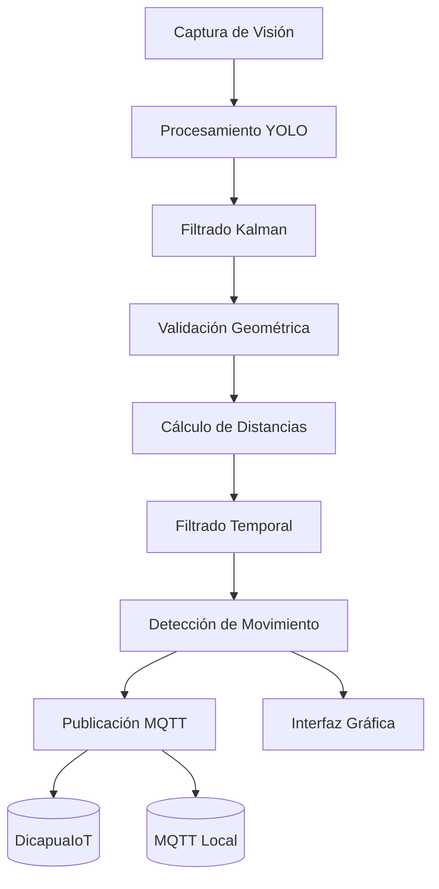

# Carpeta `src/` - Sistema Principal del Gemelo Digital

## Descripción General

La carpeta `src/` contiene el núcleo del sistema del gemelo digital de la estructura tipo pórtico, implementando un sistema completo de monitoreo, análisis y visualización en tiempo real. El sistema integra visión por computadora con YOLO v8, comunicación IoT mediante MQTT, procesamiento inteligente de datos y visualización interactiva para crear una representación digital precisa del comportamiento físico del pórtico.

## Arquitectura del Sistema

### Componentes Principales

El sistema está estructurado en módulos especializados con arquitectura modular y escalable:

```
src/
├── main.py                    # Sistema principal con DigitalTwinSystem
├── gui/                       # Interfaz gráfica interactiva
│   └── interactive_interface.py  # Interfaz Tkinter con controles en tiempo real
├── mqtt/                      # Comunicación IoT y telemetría
│   ├── dicapua_publisher.py   # Publisher para plataforma DicapuaIoT
│   └── config/                # Configuraciones MQTT y certificados
├── postprocess/               # Algoritmos avanzados de procesamiento
│   ├── distance_calculator.py      # Cálculo de distancias euclidianas
│   ├── marker_distance_calculator.py # Distancias basadas en marcadores
│   ├── movement_detector.py         # Detección inteligente de movimiento
│   ├── coordinate_axis_drawer.py    # Sistema de coordenadas visual
│   └── video_processor.py          # Procesamiento de video completo
├── utils/                     # Utilidades y funciones auxiliares
│   ├── helpers.py            # Logger, ConfigManager, PerformanceMonitor
│   └── i18n.py              # Sistema de internacionalización
├── vision/                    # Visión por computadora con IA
│   ├── detector.py           # YOLOPoseDetector con Ultralytics
│   └── tracker.py            # ObjectTracker para seguimiento temporal
└── visualization/             # Visualización y análisis gráfico
    └── visualizer.py         # GantryVisualizer con renderizado 2D/3D
```

### Clases Principales del Sistema

#### `DigitalTwinSystem` (main.py)
Orquestador central del sistema que implementa el patrón de arquitectura por capas y coordina todos los componentes del gemelo digital.

#### `InteractiveDetectionInterface` (gui/interactive_interface.py)
Interfaz gráfica interactiva desarrollada en Tkinter que proporciona controles en tiempo real, visualización de detecciones y configuración de parámetros.

### Arquitectura por Capas

#### Capa de Percepción
- **YOLOPoseDetector**: Detección de objetos y estimación de poses usando YOLO v8 de Ultralytics.
- **ObjectTracker**: Seguimiento temporal de objetos detectados con algoritmos de tracking.

#### Capa de Procesamiento de Datos
- **DistanceCalculator**: Cálculo de distancias euclidianas y métricas espaciales. 
- **MarkerDistanceCalculator**: Análisis de distancias basado en marcadores de referencia específicos.
- **MovementDetector**: Detección de movimiento con filtros de ruido y estabilidad.
- **CoordinateAxisDrawer**: Sistema de coordenadas visual para referencia espacial.

#### Capa de Comunicación IoT
- **DicapuaPublisher**: Publisher especializado para plataforma DicapuaIoT con protocolo MQTT.
- **ConfigManager**: Gestión centralizada de configuración con soporte YAML.
- **Logger**: Sistema de logging.

#### Capa de Visualización y UI
- **GantryVisualizer**: Renderizado 2D/3D en tiempo real con Matplotlib.
- **InteractiveDetectionInterface**: Interfaz de usuario completa con controles interactivos.
- **PerformanceMonitor**: Monitoreo de rendimiento y métricas del sistema.

## Principios Matemáticos y Físicos Implementados

### 1. Transformaciones de Coordenadas

El sistema implementa transformaciones entre múltiples sistemas de coordenadas:

**Coordenadas de Imagen a Mundo:**
```math
\begin{bmatrix}
X_w \\
Y_w \\
Z_w \\
1
\end{bmatrix} = 
\begin{bmatrix}
R & t \\
0^T & 1
\end{bmatrix}
\begin{bmatrix}
X_c \\
Y_c \\
Z_c \\
1
\end{bmatrix}
```

Donde:
- $(X_w, Y_w, Z_w)$ son las coordenadas del mundo real
- $(X_c, Y_c, Z_c)$ son las coordenadas de la cámara
- $R$ es la matriz de rotación 3×3
- $t$ es el vector de traslación

### 2. Análisis Cinemático

Para el seguimiento de objetos, se implementa análisis cinemático:

**Velocidad instantánea:**
```math 
\vec{v}(t) = \frac{d\vec{r}}{dt} = \lim_{\Delta t \to 0} \frac{\vec{r}(t + \Delta t) - \vec{r}(t)}{\Delta t}
```

**Aceleración:**
```math 
\vec{a}(t) = \frac{d\vec{v}}{dt} = \frac{d^2\vec{r}}{dt^2}
```

### 3. Filtrado y Estimación de Estado

El sistema utiliza métodos de filtrado para suavizar las mediciones:

**Filtro de Media Móvil:**
```math
\bar{x}_n = \frac{1}{N} \sum_{i=0}^{N-1} x_{n-i}
```

## 4. Flujo de Procesamiento

El sistema implementa un pipeline asíncrono que procesa los datos de visión, física y MQTT en paralelo, sincronizando los resultados a través de colas de mensajes. El flujo completo integra los siguientes componentes:

### Visión por Computador
1. **Detección de Objetos**: Utilizando YOLO v8 para identificar marcadores y calcular sus posiciones en píxeles.
2. **Filtrado Kalman**: Suavizado de trayectorias y predicción de posiciones futuras.
3. **Validación Geométrica**: Comprobación de la consistencia espacial de los objetos detectados.

### Postprocesamiento
1. **Cálculo de Distancias**: Conversión de píxeles a centímetros usando el factor de calibración calculado.
2. **Filtrado Temporal**: Aplicación de media móvil y filtro exponencial para reducir ruido.
3. **Detección de Movimiento**: Cálculo de velocidad y aceleración para identificar estados.

### Comunicación MQTT
1. **Publicación Dual**: Envío simultáneo a servidor DicapuaIoT y broker MQTT local.
2. **Gestión de Conexión**: Reconexión automática con backoff exponencial.
3. **Control de Flujo**: Throttling y gestión de colas para evitar saturación.

### Interfaz Gráfica
1. **Visualización en Tiem Real**: Mostrar detecciones, distancias y estados del sistema.
2. **Control de Parámetros**: Ajuste interactivo de umbrales y configuraciones.
3. **Monitorización**: Gráficos de rendimiento y logs estructurados.




## Patrones de Diseño Implementados

### 1. Patrón Observer
El sistema implementa el patrón Observer para la comunicación entre componentes:
- Los calculadores de distancia notifican al publisher MQTT.
- El visualizador se actualiza cuando hay nuevos datos.

### 2. Patrón Strategy
Diferentes estrategias de cálculo de distancia:
- `DistanceCalculator`: Distancias euclidianas generales.
- `MarkerDistanceCalculator`: Distancias basadas en marcadores específicos.

### 3. Patrón Facade
La clase `DigitalTwinSystem` actúa como una fachada que simplifica la interacción con el sistema complejo.

## Monitoreo de Rendimiento

El sistema incluye monitoreo de rendimiento integrado:

```python
performance_monitor = PerformanceMonitor()
performance_monitor.start_timer("frame_processing")
# ... procesamiento ...
performance_monitor.end_timer("frame_processing")
```

### Métricas Clave
- **Tiempo de procesamiento por frame**: Latencia del pipeline completo
- **FPS efectivo**: Frames procesados por segundo
- **Tiempo de inicialización**: Tiempo de carga de componentes
- **Uso de memoria**: Monitoreo de recursos del sistema

## Configuración del Sistema

El sistema utiliza configuración centralizada en `config/config.yaml`:

```yaml
physics:
  gravity: 9.81
  mass_default: 1.0
  force_calculation_frequency: 30

vision:
  confidence_threshold: 0.3
  tracking_enabled: true
```

## Modos de Operación

### 1. Interfaz Interactiva Principal
Interfaz gráfica completa con controles en tiempo real:
```bash
python run_interface.py
```
**Características:**
- Interfaz Tkinter con controles interactivos
- Configuración de parámetros en tiempo real
- Visualización de detecciones y keypoints
- Cálculo de distancias con múltiples algoritmos
- Comunicación DicapuaIoT integrada
- Sistema multilingüe (español/inglés)
- Captura de frames y logging avanzado

### 2. Postprocesamiento Especializado
Procesamiento de video con análisis avanzado:
```bash
# Postprocesamiento básico
python run_postprocess.py

# Con sistema de coordenadas
python run_postprocess_with_coordinates.py

# Demo de ejes de coordenadas
python run_coordinate_axis_demo.py
```

## Gestión de Errores y Robustez

El sistema implementa múltiples capas de manejo de errores:

1. **Inicialización Gradual**: Los componentes se inicializan de forma independiente
2. **Reconexión Automática**: MQTT se reconecta automáticamente en caso de fallo
3. **Modo Degradado**: El sistema continúa funcionando aunque algunos componentes fallen
4. **Logging Detallado**: Registro completo de eventos y errores

## Características Avanzadas del Sistema

### 1. Detección Inteligente de Movimiento
El `MovementDetector` implementa algoritmos para filtrar ruido y detectar movimiento real:

```python
# Configuración de filtros de movimiento
movement_detector = MovementDetector(
    distance_threshold_cm=0.5,
    velocity_threshold_cm_s=0.2,
    position_stability_frames=5,
    temporal_window_seconds=2.0
)

# Filtros disponibles
- enable_movement_detection: Detección básica de movimiento
- enable_velocity_filter: Filtro por velocidad mínima
- enable_stability_filter: Filtro de estabilidad posicional
- enable_relative_movement_filter: Movimiento relativo entre objetos
- enable_temporal_filter: Filtro temporal con ventana deslizante
```

### 2. Sistema de Coordenadas Visual
El `CoordinateAxisDrawer` proporciona referencia visual para análisis espacial:

```python
# Dibujo de ejes de coordenadas
coordinate_drawer = CoordinateAxisDrawer()
coordinate_drawer.draw_axis(frame, origin, x_axis, y_axis)
coordinate_drawer.draw_grid(frame, spacing=50)
```

### 3. Comunicación IoT 
Integración completa con plataforma DicapuaIoT:

```python
# Publisher especializado
dicapua_publisher = DicapuaPublisher()
dicapua_publisher.publish_position_data({
    'timestamp': datetime.now().isoformat(),
    'pulsador_position': (x, y),
    'portico_position': (x, y),
    'distance_cm': distance,
    'confidence': confidence
})
```

### 4. Sistema de Internacionalización
Soporte multilingüe completo:

```python
# Sistema i18n
from utils.i18n import get_i18n, t
i18n = get_i18n()
text = t('detection.confidence')  # Traduce según idioma configurado
```

### 5. Monitoreo de Rendimiento
Sistema integrado de métricas y performance:

```python
performance_monitor = PerformanceMonitor()
performance_monitor.start_timer("frame_processing")
# ... procesamiento ...
metrics = performance_monitor.end_timer("frame_processing")
```

## Dependencias Técnicas

### Librerías Principales
- **OpenCV (cv2)**: Procesamiento de imágenes y video
- **Ultralytics YOLO**: Detección de objetos con deep learning v8
- **NumPy**: Computación numérica y álgebra lineal
- **Matplotlib**: Visualización y gráficos científicos
- **Tkinter**: Interfaz gráfica de usuario nativa
- **PIL (Pillow)**: Procesamiento de imágenes

### Comunicación y Datos
- **Paho-MQTT**: Comunicación MQTT para IoT
- **PyYAML**: Gestión de configuración YAML
- **JSON**: Serialización de datos
- **Threading**: Procesamiento asíncrono
- **Queue**: Colas thread-safe para datos

### Análisis y Matemáticas
- **SciPy**: Optimización y análisis científico
- **Collections**: Estructuras de datos avanzadas
- **Dataclasses**: Clases de datos tipadas
- **Pathlib**: Manejo moderno de rutas de archivos


## Solución de Problemas Comunes

### 1. Problemas de Rendimiento
```bash
# Verificar FPS actual
python -c "from src.utils.helpers import PerformanceMonitor; print('Monitor iniciado')"

# Reducir resolución para mejor rendimiento
# Editar config/config.yaml:
vision:
  frame_width: 640
  frame_height: 480
```

### 2. Errores de Cámara
```bash
# Verificar cámaras disponibles
python -c "import cv2; [print(f'Cámara {i}: {cv2.VideoCapture(i).isOpened()}') for i in range(3)]"

# Cambiar índice de cámara en config.yaml
camera:
  index: 1  # Probar diferentes valores
```


