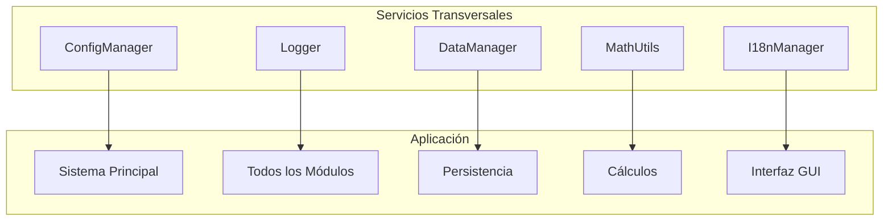

# Carpeta `utils/` - Utilidades y Funciones Auxiliares

## Descripción General

La carpeta `utils/` contiene las utilidades fundamentales y funciones auxiliares que proporcionan servicios transversales a todo el sistema del gemelo digital. Implementa funcionalidades como logging estructurado, gestión de configuración, manejo de datos, utilidades matemáticas e internacionalización.

## Arquitectura de Utilidades

### Componentes Principales



### Patrón de Diseño

Las utilidades implementan el **Patrón Singleton** y **Service Locator** para proporcionar acceso global a servicios compartidos.

## 1. Sistema de Logging (`Logger`)

### Funcionalidad Principal

Implementa un sistema de logging dual que combina logging tradicional con logging estructurado en JSON para análisis y monitoreo.

### Arquitectura de Logging

#### 1.1 Estructura de Log Entry

```python
@dataclass
class LogEntry:
    timestamp: str      # ISO 8601 timestamp
    level: str         # INFO, WARNING, ERROR
    module: str        # Nombre del módulo origen
    message: str       # Mensaje descriptivo
    data: Optional[Dict] = None  # Datos estructurados adicionales
```

#### 1.2 Configuración Multi-Handler

**Handler de Archivo:**
- Rotación diaria automática.
- Formato: `{nombre}_{YYYYMMDD}.log`.
- Encoding UTF-8 para caracteres especiales.
- Nivel mínimo: INFO.

**Handler de Consola:**
- Salida en tiempo real.
- Formato estructurado con timestamps.
- Colores diferenciados por nivel.

**Handler JSON Estructurado:**
- Un registro por línea (JSONL).
- Metadatos.

#### 1.3 Formato de Timestamp

```math
\text{timestamp} = \text{ISO 8601: } YYYY-MM-DDTHH:mm:ss.ffffff
```

Utiliza microsegundos para garantizar unicidad en eventos de alta frecuencia.

### Implementación de Logging Estructurado

#### Ejemplo de Log JSON
```json
{
  "timestamp": "2024-01-15T10:30:45.123456",
  "level": "INFO",
  "module": "distance_calculator",
  "message": "Calibración automática completada",
  "data": {
    "pixels_per_cm": 12.34,
    "reference_distance": 21.0,
    "calibration_error": 0.02
  }
}
```

#### Ventajas del Logging Estructurado

1. **Análisis Automatizado**.
2. **Métricas en Tiempo Real**.
3. **Debugging Avanzado**.
4. **Monitoreo Proactivo**.

## 2. Gestor de Configuración (`ConfigManager`)

### Funcionalidad Avanzada

Proporciona gestión centralizada de configuración con soporte para múltiples formatos, notación de punto para acceso anidado, y persistencia automática.

### Algoritmos de Configuración

#### 2.1 Acceso por Notación de Punto

**Algoritmo de Navegación:**
```python
def get(self, key_path: str, default: Any = None) -> Any:
    keys = key_path.split('.')
    value = self.config
    
    for key in keys:
        if isinstance(value, dict) and key in value:
            value = value[key]
        else:
            return default
    
    return value
```

**Complejidad Temporal:** $O(d)$ donde $d$ es la profundidad de anidamiento.

#### 2.2 Establecimiento de Valores Anidados

**Algoritmo de Creación de Estructura:**
```python
def set(self, key_path: str, value: Any):
    keys = key_path.split('.')
    config = self.config
    
    # Crear estructura anidada si no existe
    for key in keys[:-1]:
        if key not in config:
            config[key] = {}
        config = config[key]
    
    config[keys[-1]] = value
```

#### 2.3 Soporte Multi-Formato

**YAML (Recomendado):**
- Sintaxis legible por humanos
- Soporte nativo para tipos de datos
- Comentarios integrados

**JSON:**
- Intercambio estándar
- Validación estricta
- Compatibilidad universal

### Estructura de Configuración

```yaml
vision:
  model_path: "models/yolo_pose.pt"
  confidence_threshold: 0.5
  iou_threshold: 0.4
  
physics:
  gravity: 9.81
  mass_kg: 10.0
  force_calculation_frequency: 30
  
mqtt:
  broker: "localhost"
  port: 1883
  topics:
    distance_portico: "distance/portico_pulsador"
    distance_marker: "distance/marcador"
    
visualization:
  update_frequency: 30
  enable_3d: true
  real_time_plots: true
```

## 3. Gestor de Datos (`DataManager`)

### Funcionalidad de Persistencia

Implementa un sistema robusto de persistencia de datos con soporte para múltiples formatos y organización jerárquica automática.

### Arquitectura de Almacenamiento

```
data/
├── raw/           # Datos sin procesar
├── processed/     # Datos procesados
└── logs/          # Archivos de log
```

#### 3.1 Formatos Soportados

**JSON (JavaScript Object Notation):**
- Datos estructurados.
- Intercambio web.
- Legibilidad humana.

**CSV (Comma-Separated Values):**
- Datos tabulares.
- Compatibilidad con Excel/análisis.
- Eficiencia de almacenamiento.

**Pickle (Python Binary):**
- Objetos Python complejos.
- Máxima fidelidad.
- Rendimiento optimizado.

#### 3.2 Algoritmos de Serialización

**JSON con Manejo de Tipos:**
```python
def save_json(self, data: Dict[str, Any], filename: str) -> bool:
    try:
        with open(file_path, 'w', encoding='utf-8') as f:
            json.dump(data, f, indent=2, ensure_ascii=False, default=str)
        return True
    except Exception as e:
        self.logger.error(f"Error al guardar JSON: {e}")
        return False
```

**CSV con Detección Automática de Esquema:**
```python
def save_csv(self, data: List[Dict[str, Any]], filename: str) -> bool:
    if not data:
        return False
    
    # Detectar automáticamente las columnas del primer registro
    fieldnames = data[0].keys()
    
    with open(file_path, 'w', newline='', encoding='utf-8') as f:
        writer = csv.DictWriter(f, fieldnames=fieldnames)
        writer.writeheader()
        writer.writerows(data)
```

#### 3.3 Gestión de Directorios

**Creación Automática:**
```python
def __init__(self, base_dir: str = "data"):
    self.base_dir = Path(base_dir)
    
    # Crear estructura de directorios
    for dir_path in [self.raw_dir, self.processed_dir, self.logs_dir]:
        dir_path.mkdir(parents=True, exist_ok=True)
```

## 4. Utilidades Matemáticas (`MathUtils`)

### Funciones Matemáticas Especializadas

Implementa algoritmos matemáticos para cálculos geométricos, estadísticos y de procesamiento de señales específicos del gemelo digital.

### Algoritmos Implementados

#### 4.1 Distancia Euclidiana 3D

**Fórmula Matemática:**
```math
d(\mathbf{p}_1, \mathbf{p}_2) = \sqrt{(x_2-x_1)^2 + (y_2-y_1)^2 + (z_2-z_1)^2}
```

**Implementación:**
```python
@staticmethod
def distance_3d(p1: Tuple[float, float, float], 
               p2: Tuple[float, float, float]) -> float:
    return math.sqrt(sum((a - b) ** 2 for a, b in zip(p1, p2)))
```

#### 4.2 Ángulo Entre Vectores

**Fórmula del Producto Escalar:**
```math
\cos(\theta) = \frac{\mathbf{v}_1 \cdot \mathbf{v}_2}{\|\mathbf{v}_1\| \|\mathbf{v}_2\|}
```

**Implementación:**
```python
@staticmethod
def angle_between_vectors(v1: Tuple[float, float, float], 
                        v2: Tuple[float, float, float]) -> float:
    v1_array = np.array(v1)
    v2_array = np.array(v2)
    
    cos_angle = np.dot(v1_array, v2_array) / (
        np.linalg.norm(v1_array) * np.linalg.norm(v2_array)
    )
    
    # Clamp para evitar errores de precisión flotante
    cos_angle = np.clip(cos_angle, -1.0, 1.0)
    
    return math.acos(cos_angle)
```

#### 4.3 Interpolación Lineal 3D

**Fórmula Paramétrica:**
```math
\mathbf{p}(t) = (1-t)\mathbf{p}_1 + t\mathbf{p}_2, \quad t \in [0,1]
```

**Implementación:**
```python
@staticmethod
def interpolate_linear(p1: Tuple[float, float, float], 
                      p2: Tuple[float, float, float], 
                      t: float) -> Tuple[float, float, float]:
    t = max(0, min(1, t))  # Clamp t ∈ [0,1]
    
    return (
        p1[0] + t * (p2[0] - p1[0]),
        p1[1] + t * (p2[1] - p1[1]),
        p1[2] + t * (p2[2] - p1[2])
    )
```

#### 4.4 Media Móvil:

**Fórmula de Ventana Deslizante:**
```math
\bar{x}_i = \frac{1}{w} \sum_{j=i}^{i+w-1} x_j
```

Donde $w$ es el tamaño de la ventana.

**Implementación:**
```python
@staticmethod
def moving_average(data: List[float], window_size: int) -> List[float]:
    if len(data) < window_size:
        return data
    
    result = []
    for i in range(len(data) - window_size + 1):
        window = data[i:i + window_size]
        result.append(sum(window) / window_size)
    
    return result
```


#### 4.5 Normalización de Vectores

**Fórmula de Normalización:**
```math
\hat{\mathbf{v}} = \frac{\mathbf{v}}{\|\mathbf{v}\|}
```

**Implementación:**
```python
@staticmethod
def normalize_vector(vector: Tuple[float, float, float]) -> Tuple[float, float, float]:
    magnitude = math.sqrt(sum(x**2 for x in vector))
    
    if magnitude == 0:
        return (0.0, 0.0, 0.0)  # Vector cero
    
    return tuple(x / magnitude for x in vector)
```

### Aplicaciones en el Gemelo Digital

1. **Cálculos de Distancia**: Entre objetos detectados
2. **Análisis de Orientación**: Ángulos de rotación del pórtico
3. **Interpolación de Trayectorias**: Suavizado de movimientos
4. **Filtrado de Señales**: Reducción de ruido en mediciones


## 5. Sistema de Internacionalización (`I18nManager`)

### Funcionalidad Multiidioma

Implementa un sistema de internacionalización (i18n) que soporta múltiples idiomas y permite la carga dinámica de traducciones.

### Arquitectura de Traducciones

#### 5.1 Estructura de Archivos

```
locales/
├── es.json    # Español (idioma base)
└── en.json    # Inglés
```

#### 5.2 Formato de Traducciones

**Estructura Jerárquica:**
```json
{
  "app": {
    "title": "Interfaz de Detección Interactiva",
    "subtitle": "Sistema de Gemelo Digital"
  },
  "menu": {
    "file": {
      "open": "Abrir",
      "save": "Guardar",
      "exit": "Salir"
    },
    "view": {
      "zoom_in": "Acercar",
      "zoom_out": "Alejar"
    }
  },
  "detection": {
    "confidence": "Confianza: {value}%",
    "objects_found": "Objetos encontrados: {count}"
  }
}
```

#### 5.3 Algoritmo de Resolución de Traducciones

**Búsqueda con Notación de Punto:**
```python
def _get_nested_value(self, data: Dict[str, Any], key: str) -> str:
    keys = key.split('.')
    current = data
    
    for k in keys:
        if isinstance(current, dict) and k in current:
            current = current[k]
        else:
            return None
    
    return current if isinstance(current, str) else None
```

**Estrategia de Fallback:**
1. Buscar en idioma actual
2. Si no existe, buscar en español (idioma base)
3. Si no existe, devolver la clave original

#### 5.4 Interpolación de Parámetros

**Formato de Plantilla:**
```python
def t(self, key: str, **kwargs) -> str:
    translation = self._get_translation(key)
    
    if translation and kwargs:
        return translation.format(**kwargs)
    
    return translation or key
```

**Ejemplo de Uso:**
```python
# Archivo de traducción
"detection.confidence": "Confianza: {value}%"

# Código Python
i18n.t("detection.confidence", value=85)
# Resultado: "Confianza: 85%"
```

### Patrón Singleton Global

```python
# Instancia global
_i18n_manager = I18nManager()

def get_i18n() -> I18nManager:
    return _i18n_manager

def t(key: str, **kwargs) -> str:
    return _i18n_manager.t(key, **kwargs)
```

### Idiomas Soportados

| Código | Idioma | Región |
|--------|--------|---------|
| `es` | Español | España |
| `en` | English | Reino Unido |

## Principios de Diseño Implementados

### 1. Principio de Responsabilidad Única (SRP)
Cada clase tiene una responsabilidad específica y bien definida.

### 2. Principio Abierto/Cerrado (OCP)
Extensible para nuevos formatos sin modificar código existente.

### 3. Principio de Inversión de Dependencias (DIP)
Depende de abstracciones, no de implementaciones concretas.

### 4. Patrón Singleton
Instancias únicas para servicios globales (Logger, ConfigManager, I18n).

### 5. Patrón Strategy
Diferentes estrategias de serialización (JSON, CSV, Pickle).

## Optimizaciones de Rendimiento

### 1. Lazy Loading
```python
class ConfigManager:
    def __init__(self):
        self._config = None
    
    @property
    def config(self):
        if self._config is None:
            self._config = self.load_config()
        return self._config
```

### 2. Caching de Traducciones
```python
class I18nManager:
    def __init__(self):
        self._translation_cache = {}
    
    def t(self, key: str, **kwargs) -> str:
        cache_key = f"{self.current_language}:{key}"
        
        if cache_key not in self._translation_cache:
            self._translation_cache[cache_key] = self._get_translation(key)
        
        return self._translation_cache[cache_key]
```

### 3. Buffering de Logs
```python
class Logger:
    def __init__(self):
        self._log_buffer = []
        self._buffer_size = 100
    
    def _flush_buffer(self):
        if len(self._log_buffer) >= self._buffer_size:
            # Escribir buffer completo al archivo
            self._write_logs_batch(self._log_buffer)
            self._log_buffer.clear()
```

## Manejo de Errores y Robustez

### 1. Graceful Degradation
```python
def load_config(self) -> Dict[str, Any]:
    try:
        return self._load_from_file()
    except FileNotFoundError:
        self.logger.warning("Config file not found, using defaults")
        return self._get_default_config()
    except Exception as e:
        self.logger.error(f"Config load error: {e}")
        return {}
```

### 2. Validación de Entrada
```python
def set(self, key_path: str, value: Any):
    if not key_path or not isinstance(key_path, str):
        raise ValueError("Key path must be a non-empty string")
    
    if '..' in key_path or key_path.startswith('.'):
        raise ValueError("Invalid key path format")
```

### 3. Recuperación Automática
```python
def save_json(self, data: Dict[str, Any], filename: str) -> bool:
    max_retries = 3
    
    for attempt in range(max_retries):
        try:
            return self._save_json_attempt(data, filename)
        except Exception as e:
            if attempt < max_retries - 1:
                time.sleep(0.1 * (2 ** attempt))  # Backoff exponencial
            else:
                self.logger.error(f"Failed to save after {max_retries} attempts: {e}")
                return False
```

## Métricas y Monitoreo

### 1. Métricas de Logging
```python
class LoggerMetrics:
    def __init__(self):
        self.log_counts = {'INFO': 0, 'WARNING': 0, 'ERROR': 0}
        self.log_rate = 0.0
        self.last_log_time = time.time()
    
    def update_metrics(self, level: str):
        self.log_counts[level] += 1
        current_time = time.time()
        self.log_rate = 1.0 / (current_time - self.last_log_time)
        self.last_log_time = current_time
```

### 2. Métricas de Configuración
```python
class ConfigMetrics:
    def __init__(self):
        self.access_count = 0
        self.cache_hits = 0
        self.cache_misses = 0
    
    @property
    def cache_hit_rate(self) -> float:
        total = self.cache_hits + self.cache_misses
        return self.cache_hits / total if total > 0 else 0.0
```

## Casos de Uso Específicos

### 1. Logging de Eventos de Calibración
```python
logger.info("Calibración automática iniciada", {
    "reference_distance_cm": 21.0,
    "detected_keypoints": 4,
    "confidence_threshold": 0.5
})
```

### 2. Configuración Dinámica de Parámetros
```python
config.set("vision.confidence_threshold", 0.7)
config.set("mqtt.reconnect_interval", 5.0)
config.save_config()
```

### 3. Persistencia de Datos de Sesión
```python
session_data = {
    "start_time": datetime.now().isoformat(),
    "detections_count": 1250,
    "average_confidence": 0.87,
    "calibration_history": calibration_values
}

data_manager.save_json(session_data, "session_20240115", "processed")
```

### 4. Cálculos Geométricos Avanzados
```python
# Calcular centroide de keypoints
keypoints_3d = [(x1, y1, z1), (x2, y2, z2), (x3, y3, z3)]
centroid = MathUtils.calculate_centroid(keypoints_3d)

# Interpolación de trayectoria
start_pos = (0, 0, 0)
end_pos = (100, 50, 25)
intermediate_pos = MathUtils.interpolate_linear(start_pos, end_pos, 0.5)
```

### 5. Interfaz Multiidioma
```python
# Cambio dinámico de idioma
i18n.set_language('en')
title = i18n.t('app.title')  # "Interactive Detection Interface"

# Mensajes con parámetros
message = i18n.t('detection.objects_found', count=5)
# "Objects found: 5"
```

## Dependencias Técnicas

- **json**: Serialización JSON estándar
- **yaml**: Procesamiento de archivos YAML
- **csv**: Manejo de archivos CSV
- **logging**: Sistema de logging de Python
- **numpy**: Operaciones matemáticas vectorizadas
- **pathlib**: Manejo moderno de rutas de archivos
- **hashlib**: Funciones de hash criptográficas
- **pickle**: Serialización binaria de Python
- **dataclasses**: Estructuras de datos inmutables
- **datetime**: Manejo de fechas y tiempos
- **math**: Funciones matemáticas básicas


La carpeta `utils/` representa la base del sistema, proporcionando servicios que garantizan la robustez, mantenibilidad y escalabilidad del gemelo digital.