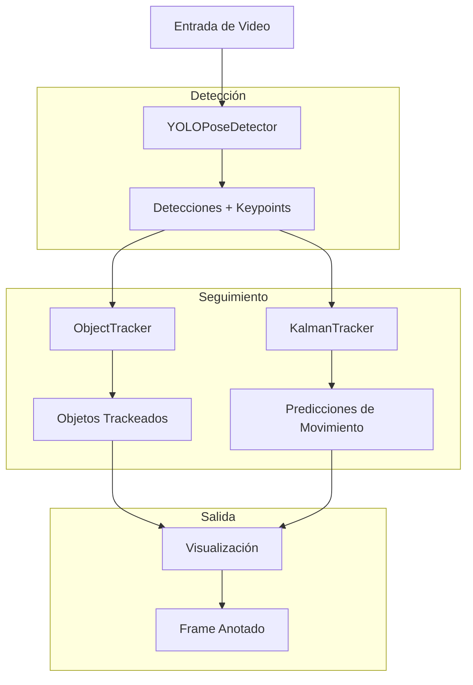

# Carpeta `vision/` - Sistema de Visión por Computadora

## Descripción General

La carpeta `vision/` implementa el sistema de visión por computadora del gemelo digital, proporcionando capacidades de detección "Pose" y seguimiento de objetos en tiempo real. Se utiliza el modelo YOLO v8 (You Only Look Once) para detección de poses y algoritmos de seguimiento multi-objeto, incluyendo filtros de Kalman para predicción de movimiento.

## Arquitectura del Sistema de Visión

### Componentes Principales



### Flujo de Procesamiento

1. **Captura de Frame**: Adquisición de imagen desde cámara o video
2. **Detección YOLO**: Identificación de objetos y keypoints
3. **Extracción de Características**: Bounding boxes, confianza, keypoints
4. **Asociación de Datos**: Matching entre detecciones y tracks existentes
5. **Actualización de Tracks**: Mantenimiento de trayectorias
6. **Predicción Kalman**: Estimación de posiciones futuras
7. **Visualización**: Renderizado de resultados

## 1. Detector YOLO (`YOLOPoseDetector`)

### Funcionalidad Principal

Implementa un detector de poses basado en YOLO que combina detección de objetos con estimación de keypoints.

### Arquitectura YOLO

#### 1.1 Fundamentos Matemáticos de YOLO

**Función de Pérdida Multi-Objetivo:**
```math
\mathcal{L} = \mathcal{L}_{\text{box}} + \mathcal{L}_{\text{obj}} + \mathcal{L}_{\text{cls}} + \mathcal{L}_{\text{kpt}}
```

Donde:
- $\mathcal{L}_{\text{box}}$: Pérdida de localización de bounding box
- $\mathcal{L}_{\text{obj}}$: Pérdida de objetividad (confianza)
- $\mathcal{L}_{\text{cls}}$: Pérdida de clasificación
- $\mathcal{L}_{\text{kpt}}$: Pérdida de keypoints

**Pérdida de Bounding Box (IoU Loss):**
```math
\mathcal{L}_{\text{box}} = 1 - \text{IoU}(\text{pred}, \text{gt})
```

**Intersection over Union (IoU):**
```math
\text{IoU} = \frac{|A \cap B|}{|A \cup B|} = \frac{\text{Área de Intersección}}{\text{Área de Unión}}
```

#### 1.2 Detección de Keypoints

**Representación de Keypoints:**
Cada keypoint se representa como $(x, y, v)$ donde:
- $x, y$: Coordenadas en píxeles
- $v$: Visibilidad/confianza $\in [0, 1]$

**Pérdida de Keypoints:**
```math
\mathcal{L}_{\text{kpt}} = \sum_{i=1}^{N} v_i \cdot |\|\mathbf{p}_i^{\text{pred}} - \mathbf{p}_i^{\text{gt}}\||_2^2
```

Donde $N$ es el número de keypoints y $v_i$ es la visibilidad del keypoint $i$.

#### 1.3 Configuración del Modelo

**Parámetros de Configuración:**
```python
config = {
    'vision': {
        'confidence_threshold': 0.87,  # Umbral de confianza
        'yolo_model_path': 'models/best.pt'  # Ruta del modelo entrenado
    }
}
```

**Umbral de Confianza:**
Filtra detecciones con confianza $c < \theta$ donde $\theta = 0.87$:
```math
\text{Detección válida} \iff c \geq \theta
```

### Algoritmos de Detección

#### 1.4 Procesamiento de Detecciones

**Extracción de Bounding Box:**
```python
def extract_bbox(box_tensor):
    x1, y1, x2, y2 = box.xyxy[0].cpu().numpy()
    confidence = float(box.conf[0].cpu().numpy())
    class_id = int(box.cls[0].cpu().numpy())
    return [x1, y1, x2, y2], confidence, class_id
```

**Cálculo de Centroide:**
```math
\text{centroide} = \left(\frac{x_1 + x_2}{2}, \frac{y_1 + y_2}{2}\right)
```

#### 1.5 Procesamiento de Keypoints

**Estructura de Keypoints:**
```python
keypoints_structure = {
    'xy': np.array([[x1, y1], [x2, y2], ...]),  # Coordenadas
    'conf': np.array([c1, c2, ...])             # Confianzas
}
```

**Filtrado por Confianza:**
```math
\text{Keypoint válido} \iff c_{\text{kpt}} > 0.5
```

### Optimizaciones de Rendimiento

#### 1.6 Inferencia Optimizada

**Configuración de Inferencia:**
```python
results = model(frame, 
               conf=confidence_threshold,  # Filtrado temprano
               verbose=False,              
               device='cuda' if torch.cuda.is_available() else 'cpu')
```

## 2. Sistema de Seguimiento (`ObjectTracker`)

### Funcionalidad de Tracking

Se implementa un sistema de seguimiento multi-objeto que mantiene identidades consistentes a través del tiempo, manejando oclusiones, apariciones y desapariciones de objetos.

### Algoritmos de Seguimiento

#### 2.1 Algoritmo de Asociación de Datos

**Problema de Asignación:**
Dadas $n$ detecciones y $m$ tracks existentes, encontrar la asignación óptima que minimice el costo total.

**Matriz de Costos:**
```math 
C_{ij} = |\|\mathbf{c}_i^{\text{track}} - \mathbf{c}_j^{\text{det}}\||_2
```

Donde $\mathbf{c}_i^{\text{track}}$ es el centroide del track $i$ y $\mathbf{c}_j^{\text{det}}$ es el centroide de la detección $j$.

#### 2.2 Algoritmo Kuhn-Munkres (o Húngaro) Simplificado

**Implementación:**
```python
def hungarian_assignment(cost_matrix):
    rows, cols = [], []
    
    for i in range(min(cost_matrix.shape)):
        min_idx = np.unravel_index(np.argmin(cost_matrix), cost_matrix.shape)
        rows.append(min_idx[0])
        cols.append(min_idx[1])
        
        # Invalidar fila y columna usadas
        cost_matrix[min_idx[0], :] = np.inf
        cost_matrix[:, min_idx[1]] = np.inf
    
    return rows, cols
```

#### 2.3 Gestión del Ciclo de Vida de Objetos

**Estados de Objeto:**
- **Activo**: Objeto detectado en el frame actual
- **Perdido**: Objeto no detectado, contador de desaparición < umbral
- **Eliminado**: Objeto no detectado, contador $\geq$ umbral máximo

#### 2.4 Cálculo de Velocidad

**Velocidad Instantánea:**
```math
\mathbf{v}(t) = \frac{\mathbf{p}(t) - \mathbf{p}(t-1)}{\Delta t} \cdot \text{fps}
```

Donde:
- $\mathbf{p}(t)$: Posición en el frame $t$
- $\Delta t = 1/\text{fps}$: Intervalo de tiempo entre frames

**Implementación:**
```python
def get_velocity(self, object_id, fps=30.0):
    track = self.tracks[object_id]
    if len(track) < 2:
        return None
    
    p1 = np.array(track[-2])
    p2 = np.array(track[-1])
    velocity = (p2 - p1) * fps
    
    return tuple(velocity)
```

### Gestión de Memoria y Optimización

#### 2.5 Limitación de Historial

**Buffer Circular para Tracks:**
```python
if len(self.tracks[object_id]) > 50:
    self.tracks[object_id] = self.tracks[object_id][-50:]
```

#### 2.6 Parámetros de Configuración

| Parámetro | Valor por Defecto | Descripción |
|-----------|-------------------|-------------|
| `max_disappeared` | 30 | Frames máximos sin detección |
| `max_distance` | 100.0 | Distancia máxima para asociación |
| `track_history` | 50 | Puntos máximos en historial |

## 3. Filtro de Kalman (`KalmanTracker`)

### Fundamentos Teóricos

Se ha implementado un filtro de Kalman lineal para la predicción del movimiento de las clases detectadas en tiempo real, proporcionando estimaciones y predicciones robustas de trayectorias de objetos.

### Modelo Matemático del Filtro de Kalman

#### 3.1 Modelo de Estado

**Vector de Estado:**
```math
\mathbf{x}_k = \begin{bmatrix} x \\
 y \\
 \dot{x} \\
 \dot{y} \end{bmatrix}_k
```

Donde $(x, y)$ es la posición y $(\dot{x}, \dot{y})$ es la velocidad.

**Matriz de Transición:**
```math
\mathbf{F} = \begin{bmatrix}
1 & 0 & \Delta t & 0 \\
0 & 1 & 0 & \Delta t \\
0 & 0 & 1 & 0 \\
0 & 0 & 0 & 1
\end{bmatrix}
```

**Modelo de Movimiento:**
```math
\mathbf{x}_{k+1} = \mathbf{F} \mathbf{x}_k + \mathbf{w}_k
```

Donde $\mathbf{w}_k \sim \mathcal{N}(0, \mathbf{Q})$ es el ruido del proceso.

#### 3.2 Modelo de Observación

**Vector de Medición:**
```math
\mathbf{z}_k = \begin{bmatrix} x_{\text{obs}} \\
 y_{\text{obs}} \end{bmatrix}_k
```

**Matriz de Observación:**
```math
\mathbf{H} = \begin{bmatrix}
1 & 0 & 0 & 0 \\
0 & 1 & 0 & 0
\end{bmatrix}
```

**Modelo de Observación:**
```math
\mathbf{z}_k = \mathbf{H} \mathbf{x}_k + \mathbf{v}_k
```

Donde $\mathbf{v}_k \sim \mathcal{N}(0, \mathbf{R})$ es el ruido de medición.

#### 3.3 Ecuaciones del Filtro de Kalman

**Predicción:**
```math
\begin{align}
\hat{\mathbf{x}}_{k|k-1} &= \mathbf{F} \hat{\mathbf{x}}_{k-1|k-1} \\
\mathbf{P}_{k|k-1} &= \mathbf{F} \mathbf{P}_{k-1|k-1} \mathbf{F}^T + \mathbf{Q}
\end{align}
```

**Actualización:**
```math
\begin{align}
\mathbf{K}_k &= \mathbf{P}_{k|k-1} \mathbf{H}^T (\mathbf{H} \mathbf{P}_{k|k-1} \mathbf{H}^T + \mathbf{R})^{-1} \\
\hat{\mathbf{x}}_{k|k} &= \hat{\mathbf{x}}_{k|k-1} + \mathbf{K}_k (\mathbf{z}_k - \mathbf{H} \hat{\mathbf{x}}_{k|k-1}) \\
\mathbf{P}_{k|k} &= (\mathbf{I} - \mathbf{K}_k \mathbf{H}) \mathbf{P}_{k|k-1}
\end{align}
```

#### 3.4 Configuración de Matrices de Ruido

**Ruido del Proceso:**
```math
\mathbf{Q} = 0.03 \cdot \mathbf{I}_4
```

**Ruido de Medición:**
```math
\mathbf{R} = 0.1 \cdot \mathbf{I}_2
```

### Implementación del Filtro

#### 3.5 Inicialización

```python
def initialize(self, initial_position):
    self.kalman.statePre = np.array([
        initial_position[0],  # x
        initial_position[1],  # y
        0,                    # vx
        0                     # vy
    ], dtype=np.float32)
    
    self.kalman.statePost = self.kalman.statePre.copy()
```

#### 3.6 Predicción y Actualización

**Predicción:**
```python
def predict(self):
    prediction = self.kalman.predict()
    return (float(prediction[0]), float(prediction[1]))
```

**Actualización:**
```python
def update(self, measurement):
    measurement_array = np.array([
        [measurement[0]], 
        [measurement[1]]
    ], dtype=np.float32)
    
    self.kalman.correct(measurement_array)
```

### Ventajas del Filtro de Kalman

1. **Suavizado de Trayectorias**: Reduce ruido en las mediciones y suaviza las trayectorias.
2. **Predicción de Movimiento**: Estima posiciones futuras.
3. **Manejo de Oclusiones**: Mantiene tracking durante pérdidas temporales.
4. **Estimación de Velocidad**: Calcula velocidades sin diferenciación numérica.
5. **Optimización Bayesiana**: Combina predicciones con observaciones.

## Visualización y Renderizado

### Algoritmos de Dibujo

#### 4.1 Renderizado de Bounding Boxes

```python
def draw_bbox(frame, bbox, confidence, class_name):
    x1, y1, x2, y2 = map(int, bbox)
    
    # Dibujar rectángulo
    cv2.rectangle(frame, (x1, y1), (x2, y2), (0, 255, 0), 2)
    
    # Dibujar etiqueta con fondo
    label = f"{class_name}: {confidence:.2f}"
    label_size = cv2.getTextSize(label, cv2.FONT_HERSHEY_SIMPLEX, 0.5, 2)[0]
    
    cv2.rectangle(frame, (x1, y1 - label_size[1] - 10), 
                 (x1 + label_size[0], y1), (0, 255, 0), -1)
    
    cv2.putText(frame, label, (x1, y1 - 5), 
               cv2.FONT_HERSHEY_SIMPLEX, 0.5, (0, 0, 0), 2)
```

#### 4.2 Renderizado de Keypoints

```python
def draw_keypoints(frame, keypoints, confidence_threshold=0.5):
    for kpt in keypoints:
        x, y, conf = kpt
        if conf > confidence_threshold:
            cv2.circle(frame, (int(x), int(y)), 3, (0, 0, 255), -1)
```

#### 4.3 Renderizado de Trayectorias

```python
def draw_tracks(frame, tracked_objects):
    for object_id, obj_info in tracked_objects.items():
        track = obj_info['track']
        
        if len(track) > 1:
            points = np.array(track, dtype=np.int32)
            cv2.polylines(frame, [points], False, (0, 255, 255), 2)
        
        # Dibujar centroide actual
        centroid = obj_info['centroid']
        cv2.circle(frame, (int(centroid[0]), int(centroid[1])), 5, (0, 0, 255), -1)
        
        # Dibujar ID
        cv2.putText(frame, f"ID: {object_id}", 
                   (int(centroid[0]) - 10, int(centroid[1]) - 10),
                   cv2.FONT_HERSHEY_SIMPLEX, 0.5, (0, 0, 255), 2)
```

## Métricas de Rendimiento

### Métricas de Detección

#### 5.1 Precisión y Recall

**Precisión:**
```math
\text{Precision} = \frac{\text{TP}}{\text{TP} + \text{FP}}
```
Donde: 
- $\text{TP}$: True Positives.
- $\text{FP}$: False Positives.
- $\text{FN}$: False Negatives.

**Recall:**
```math
\text{Recall} = \frac{\text{TP}}{\text{TP} + \text{FN}}
```
Donde:
- $\text{TP}$: True Positives.
- $\text{FN}$: False Negatives.

**F1-Score:**
```math
\text{F1} = 2 \cdot \frac{\text{Precision} \cdot \text{Recall}}{\text{Precision} + \text{Recall}}
```

#### 5.2 Métricas de Tracking

**MOTA (Multiple Object Tracking Accuracy):**
```math
\text{MOTA} = 1 - \frac{\sum_t (\text{FN}_t + \text{FP}_t + \text{IDSW}_t)}{\sum_t \text{GT}_t}
```

Donde:
- $\text{FN}_t$: False Negatives en el frame $t$.
- $\text{FP}_t$: False Positives en el frame $t$.
- $\text{IDSW}_t$: ID Switches en el frame $t$.
- $\text{GT}_t$: Ground Truth objects en el frame $t$.

**MOTP (Multiple Object Tracking Precision):**
```math
\text{MOTP} = \frac{\sum_{t,i} d_{t,i}}{\sum_t c_t}
```

Donde $d_{t,i}$ es la distancia entre objeto $i$ y su detección en frame $t$, y $c_t$ es el número de matches en frame $t$.

### Optimizaciones de Rendimiento

#### 5.3 Procesamiento en GPU

```python
# Configuración automática de dispositivo
device = 'cuda' if torch.cuda.is_available() else 'cpu'
model = YOLO(model_path).to(device)

# Inferencia optimizada
with torch.no_grad():
    results = model(frame, device=device)
```

#### 5.4 Optimización de Memoria

```python
# Liberación de memoria GPU
torch.cuda.empty_cache()

# Procesamiento por lotes para múltiples frames
batch_results = model(frame_batch, batch_size=4)
```

#### 5.5 Paralelización

```python
import multiprocessing as mp

def parallel_detection(frame_queue, result_queue):
    detector = YOLOPoseDetector()
    detector.load_model()
    
    while True:
        frame = frame_queue.get()
        if frame is None:
            break
        
        detections = detector.get_detections_data(frame)
        result_queue.put(detections)
```

## Casos de Uso Específicos

### 1. Detección en Tiempo Real

```python
detector = YOLOPoseDetector()
detector.load_model()

cap = cv2.VideoCapture(0)
tracker = ObjectTracker()

while True:
    ret, frame = cap.read()
    if not ret:
        break
    
    # Detección
    detections = detector.get_detections_data(frame)
    
    # Tracking
    tracked_objects = tracker.update(detections)
    
    # Visualización
    annotated_frame = detector.draw_detections(frame, detections)
    annotated_frame = tracker.draw_tracks(annotated_frame, tracked_objects)
    
    cv2.imshow('Detection + Tracking', annotated_frame)
    
    if cv2.waitKey(1) & 0xFF == ord('q'):
        break
```

### 2. Análisis de Trayectorias

```python
# Análisis de patrones de movimiento
for object_id, obj_info in tracked_objects.items():
    track = obj_info['track']
    
    if len(track) > 10:
        # Calcular velocidad promedio
        velocities = []
        for i in range(1, len(track)):
            v = np.linalg.norm(np.array(track[i]) - np.array(track[i-1]))
            velocities.append(v)
        
        avg_velocity = np.mean(velocities)
        
        # Detectar cambios de dirección
        direction_changes = 0
        for i in range(2, len(track)):
            v1 = np.array(track[i-1]) - np.array(track[i-2])
            v2 = np.array(track[i]) - np.array(track[i-1])
            
            if np.dot(v1, v2) < 0:  # Cambio de dirección
                direction_changes += 1
```

### 3. Calibración Automática

```python
def auto_calibrate_from_detections(detections, known_object_size_cm):
    """Calibra píxeles por cm usando objetos de tamaño conocido."""
    
    for detection in detections:
        if detection['class_name'] == 'reference_object':
            bbox = detection['bbox']
            pixel_width = bbox[2] - bbox[0]
            pixel_height = bbox[3] - bbox[1]
            
            # Usar la dimensión mayor para calibración
            pixel_size = max(pixel_width, pixel_height)
            pixels_per_cm = pixel_size / known_object_size_cm
            
            return pixels_per_cm
    
    return None
```

## Dependencias Técnicas

- **ultralytics**: Framework YOLO oficial.
- **opencv-python**: Procesamiento de imágenes y video. 
- **numpy**: Operaciones numéricas y matriciales.
- **torch**: Framework de deep learning.
- **yaml**: Configuración en formato YAML.
- **scipy**: Algoritmos científicos (Hungarian Algorithm).
- **matplotlib**: Visualización de métricas.

## Consideraciones de Rendimiento

### Benchmarks de Rendimiento

| Resolución | FPS (GPU) | FPS (CPU) | Memoria GPU |
|------------|-----------|-----------|-------------|
| 640x480 | 60-80 | 15-25 | 2-3 GB |
| 1920x1080 | 15-25 | 3-8 | 4-6 GB |

### Optimizaciones Recomendadas

1. **Reducción de Resolución**: Procesar a menor resolución cuando sea posible.
5. **Batch Processing**: Procesar múltiples frames simultáneamente.

La carpeta `vision/` representa el corazón del sistema de gemelo digital, combinando algoritmos de visión por computadora y tracking.