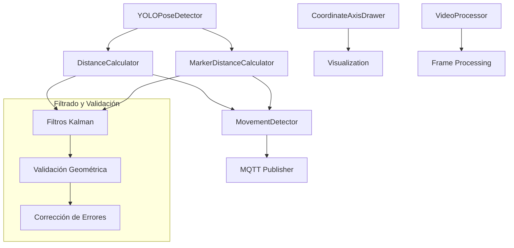
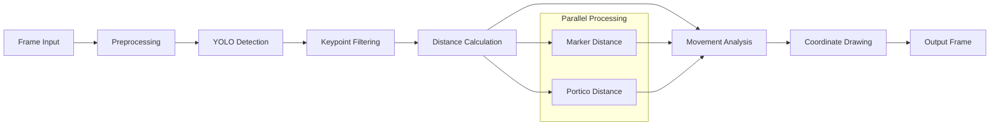

# Carpeta `postprocess/` - Procesamiento y Análisis de Datos

## Descripción General

La carpeta `postprocess/` contiene los módulos de procesamiento avanzado del sistema de gemelo digital, implementando algoritmos matemáticos y físicos para el análisis de detecciones, cálculo de distancias, filtrado de ruido, detección de movimiento y transformaciones geométricas. Esta capa actúa como el cerebro analítico del sistema, convirtiendo datos brutos de detección en información procesada y validada.

## Arquitectura del Sistema de Procesamiento

### Componentes Principales



### Flujo de Procesamiento

1. **Recepción de Detecciones**: Datos brutos de YOLO
2. **Filtrado Kalman**: Reducción de ruido en keypoints
3. **Validación Geométrica**: Verificación de coherencia espacial
4. **Cálculo de Distancias**: Métricas euclidianas y transformaciones
5. **Detección de Movimiento**: Análisis temporal y filtrado inteligente
6. **Comunicación**: Envío de datos procesados vía MQTT

## 1. Calculador de Distancias (`distance_calculator.py`)

### Funcionalidad Principal

Implementa el cálculo de distancias entre el pulsador y el pórtico con calibración automática, filtrado Kalman y corrección geométrica.

### Algoritmos Matemáticos Implementados

#### 1.1 Distancia Euclidiana

La distancia fundamental entre dos puntos se calcula usando:

$$d = \sqrt{(x_2 - x_1)^2 + (y_2 - y_1)^2}$$

Donde $(x_1, y_1)$ y $(x_2, y_2)$ son las coordenadas de los puntos en el espacio de imagen.

#### 1.2 Calibración Automática

El sistema utiliza la distancia conocida entre keypoints C y B del pórtico (21 cm) para calibrar automáticamente:

$$\text{pixels\_per\_cm} = \frac{d_{pixels}(C, B)}{21.0 \text{ cm}}$$

**Calibración con Promedio Ponderado:**

$$\text{calibration}_{final} = \frac{\sum_{i=1}^{n} w_i \cdot c_i}{\sum_{i=1}^{n} w_i}$$

Donde $w_i = e^{-\alpha(n-i)}$ son pesos exponenciales que favorecen calibraciones más recientes.

#### 1.3 Filtros Kalman para Keypoints

**Modelo de Estado:**

$$\mathbf{x}_k = \begin{bmatrix} x \\ y \\ \dot{x} \\ \dot{y} \end{bmatrix}_k$$

**Matriz de Transición:**

$$\mathbf{F} = \begin{bmatrix}
1 & 0 & 1 & 0 \\
0 & 1 & 0 & 1 \\
0 & 0 & 1 & 0 \\
0 & 0 & 0 & 1
\end{bmatrix}$$

**Matriz de Observación:**

$$\mathbf{H} = \begin{bmatrix}
1 & 0 & 0 & 0 \\
0 & 1 & 0 & 0
\end{bmatrix}$$

**Ecuaciones de Predicción:**

$$\hat{\mathbf{x}}_{k|k-1} = \mathbf{F} \hat{\mathbf{x}}_{k-1|k-1}$$

$$\mathbf{P}_{k|k-1} = \mathbf{F} \mathbf{P}_{k-1|k-1} \mathbf{F}^T + \mathbf{Q}$$

**Ecuaciones de Actualización:**

$$ \mathbf{K}_k = \mathbf{P}_{k|k-1} \mathbf{H}^T (\mathbf{H} \mathbf{P}_{k|k-1} \mathbf{H}^T + \mathbf{R})^{-1} $$

$$\hat{\mathbf{x}}_{k|k} = \hat{\mathbf{x}}_{k|k-1} + \mathbf{K}_k (\mathbf{z}_k - \mathbf{H} \hat{\mathbf{x}}_{k|k-1})$$

#### 1.4 Validación Geométrica del Rectángulo

Verifica que los keypoints del pórtico mantengan las proporciones correctas:

$$
\text{ratio} = \frac{d(D,C)}{d(C,B)} \approx \frac{30.0 \text{ cm}}{21.0 \text{ cm}} = 1.429
$$

**Criterio de Validación:**
$$
\text{error} = \frac{|\text{ratio}_{observed} - \text{ratio}_{expected}|}{\text{ratio}_{expected}} < 0.15
$$

#### 1.5 Corrección Geométrica por Mínimos Cuadrados

Cuando la geometría no es válida, se aplica optimización:

**Función Objetivo:**
$$
\min_{\mathbf{p}} \sum_{i=1}^{4} w_i \|\mathbf{r}_i - \mathbf{r}_i^{ideal}(\mathbf{p})\|^2
$$

Donde:
- $\mathbf{p} = [c_x, c_y, w, h, \theta]$ son los parámetros del rectángulo
- $w_i$ es la confianza del keypoint $i$
- $\mathbf{r}_i^{ideal}$ son las posiciones ideales del rectángulo

**Posiciones Ideales del Rectángulo:**

$$\mathbf{r}_A = \begin{bmatrix} c_x - \frac{w}{2}\cos\theta + \frac{h}{2}\sin\theta \\ c_y - \frac{w}{2}\sin\theta - \frac{h}{2}\cos\theta \end{bmatrix}$$


### Implementación de Filtrado Temporal

#### Suavizado Exponencial

$$\mathbf{p}_{smooth} = \frac{\sum_{i=1}^{n} e^{-\alpha(n-i)} \mathbf{p}_i}{\sum_{i=1}^{n} e^{-\alpha(n-i)}}$$

## 2. Calculador de Distancias de Marcador (`marker_distance_calculator.py`)

### Funcionalidad Específica

Calcula la distancia entre el punto medio superior de la bounding box del marcador y el centroide de sus keypoints.

### Algoritmos Implementados

#### 2.1 Cálculo del Centroide de Keypoints

$$\mathbf{c} = \frac{1}{n} \sum_{i=1}^{n} \mathbf{k}_i$$

Donde $\mathbf{k}_i$ son los keypoints válidos (confianza > 0.5).

#### 2.2 Punto Medio Superior de Bounding Box


$$\mathbf{p}_{top} = \begin{bmatrix} \frac{x_1 + x_2}{2} \\ y_1 \end{bmatrix}$$

Donde $(x_1, y_1, x_2, y_2)$ define la bounding box.

#### 2.3 Corrección de Calibración

Aplica un factor de corrección específico para el marcador:

$$d_{corrected} = \max(0, d_{raw} - 0.9 \text{ cm})$$

Este ajuste compensa el muelle provisional del sistema mecánico.

## 3. Detector de Movimiento (`movement_detector.py`)

### Funcionalidad Avanzada

Implementa filtrado inteligente para evitar transmisiones MQTT innecesarias, analizando patrones de movimiento real vs. ruido de detección.

### Algoritmos de Análisis Temporal

#### 3.1 Cálculo de Velocidad

**Velocidad Instantánea:**

$$v_i = \frac{\|\mathbf{p}_{i+1} - \mathbf{p}_i\|}{t_{i+1} - t_i}$$

**Velocidad Promedio en Ventana Temporal:**

$$\bar{v} = \frac{1}{n-1} \sum_{i=1}^{n-1} v_i$$

#### 3.2 Análisis de Estabilidad de Posición

**Desviación Estándar de Posiciones:**

$$\sigma_{pos} = \sqrt{\frac{1}{n} \sum_{i=1}^{n} \|\mathbf{p}_i - \bar{\mathbf{p}}\|^2}$$

**Criterio de Estabilidad:**

$$\text{stable} = (\sigma_{pos} < \sigma_{threshold}) \land (\bar{v} < v_{threshold})$$

#### 3.3 Filtros de Movimiento

**Filtro de Umbral de Distancia:**

$$\text{send} = |d_{current} - d_{last}| > \Delta d_{threshold}$$

**Filtro de Velocidad:**

$$\text{send} = \bar{v} > v_{threshold}$$

**Filtro Temporal:**

$$\text{send} = (t_{current} - t_{last\_send}) > \Delta t_{min}$$

#### 3.4 Algoritmo de Decisión Combinado


$$\text{should\_send} = \bigwedge_{i} \text{filter}_i \land \text{movement\_detected}$$

Donde cada filtro puede ser habilitado/deshabilitado dinámicamente.

### Métricas de Rendimiento

El sistema mantiene estadísticas de filtrado:

- **Tasa de Filtrado**: $\frac{\text{mensajes filtrados}}{\text{total de cálculos}}$
- **Eficiencia de Red**: Reducción de tráfico MQTT
- **Precisión de Detección**: Verdaderos positivos vs. falsos positivos

## 4. Dibujador de Ejes de Coordenadas (`coordinate_axis_drawer.py`)

### Sistema de Coordenadas Visual

Implementa un sistema de referencia visual para orientación espacial en las imágenes.

### Transformaciones Geométricas

#### 4.1 Cálculo de Posición de Origen

**Esquina Inferior Derecha (por defecto):**

$$\mathbf{o} = \begin{bmatrix} w - m - \frac{s}{2} \\ h - m - \frac{s}{2} \end{bmatrix}$$

Donde $w$ y $h$ son las dimensiones de la imagen, $m$ es el margen y $s$ es el tamaño del sistema.

#### 4.2 Vectores de Ejes

**Eje X (positivo hacia la derecha):**

$$\mathbf{v}_x = \begin{bmatrix} \frac{s}{2} \\ 0 \end{bmatrix}$$

**Eje Z (positivo hacia abajo):**

$$\mathbf{v}_z = \begin{bmatrix} 0 \\ \frac{s}{2} \end{bmatrix}$$

#### 4.3 Generación de Flechas

**Cálculo del Ángulo:**

$$\theta = \arctan2(\Delta y, \Delta x)$$

**Puntas de Flecha:**

$$\mathbf{p}_1 = \mathbf{end} - L \begin{bmatrix} \cos(\theta - \frac{\pi}{6}) \\ \sin(\theta - \frac{\pi}{6}) \end{bmatrix}
$$
$$
\mathbf{p}_2 = \mathbf{end} - L \begin{bmatrix} \cos(\theta + \frac{\pi}{6}) \\ \sin(\theta + \frac{\pi}{6}) \end{bmatrix}
$$

Donde $L$ es la longitud de las puntas (8 píxeles).

## 5. Procesador de Video (`video_processor.py`)

### Pipeline de Procesamiento

Gestiona el flujo completo de procesamiento de frames de video, integrando todos los componentes de análisis.

### Arquitectura de Procesamiento



## Principios Físicos y Matemáticos Subyacentes

### 1. Teoría de Estimación

#### Filtro de Kalman
Basado en la teoría de estimación óptima bayesiana, minimiza el error cuadrático medio:

$$
\min E[\|\mathbf{x} - \hat{\mathbf{x}}\|^2]
$$

#### Estimación de Máxima Verosimilitud
Para la calibración automática:

$$
\hat{\theta}_{MLE} = \arg\max_{\theta} \prod_{i=1}^{n} p(x_i | \theta)
$$

### 2. Geometría Proyectiva

#### Transformación de Coordenadas
De píxeles a coordenadas del mundo real:

$$
\begin{bmatrix} X \\ Y \\ Z \end{bmatrix} = \mathbf{K}^{-1} \begin{bmatrix} u \\ v \\ 1 \end{bmatrix} \cdot d
$$

Donde $\mathbf{K}$ es la matriz de calibración intrínseca y $d$ es la profundidad.

#### Corrección de Distorsión
$$
\mathbf{p}_{corrected} = \mathbf{p}_{distorted} + \mathbf{f}(\mathbf{p}_{distorted}, \mathbf{k})
$$

### 3. Procesamiento de Señales

#### Filtrado Pasa-Bajas
Para suavizado temporal:

$$
y[n] = \alpha x[n] + (1-\alpha) y[n-1]
$$

#### Análisis Espectral
Detección de frecuencias de ruido:

$$
X(\omega) = \int_{-\infty}^{\infty} x(t) e^{-j\omega t} dt
$$

### 4. Optimización Numérica

#### Método de Levenberg-Marquardt
Para corrección geométrica:

$$
(\mathbf{J}^T\mathbf{J} + \lambda\mathbf{I})\mathbf{h} = -\mathbf{J}^T\mathbf{f}
$$

#### Descenso de Gradiente
$$
\mathbf{x}_{k+1} = \mathbf{x}_k - \alpha \nabla f(\mathbf{x}_k)
$$

## Configuración y Parámetros

### Archivo `movement_config.json`

```json
{
  "movement_detection": {
    "distance_threshold_cm": 0.5,
    "velocity_threshold_cm_s": 0.2,
    "position_stability_frames": 5,
    "temporal_window_seconds": 2.0,
    "position_noise_threshold_px": 2.0,
    "distance_noise_threshold_cm": 0.3,
    "min_time_between_sends_ms": 500
  },
  "mqtt_filtering": {
    "enable_movement_detection": true,
    "enable_velocity_filter": true,
    "enable_stability_filter": true,
    "enable_relative_movement_filter": true,
    "enable_temporal_filter": true
  },
  "debug": {
    "log_movement_metrics": true,
    "log_filtered_attempts": false
  }
}
```

### Parámetros de Calibración

- **Distancia de Referencia**: 21.0 cm (keypoints C-B del pórtico)
- **Dimensiones del Pórtico**: 30.0 cm × 21.0 cm
- **Umbral de Error Geométrico**: 15%
- **Ventana de Calibración**: 10 mediciones

### Parámetros de Filtros Kalman

- **Ruido de Proceso**: $Q = 0.03 \cdot I_4$
- **Ruido de Medición**: $R = 0.1 \cdot I_2$
- **Covarianza Inicial**: $P_0 = 0.1 \cdot I_4$

## Patrones de Diseño Implementados

### 1. Patrón Strategy
Diferentes algoritmos de filtrado pueden ser seleccionados dinámicamente.

### 2. Patrón Observer
Notificación de cambios de estado en detectores de movimiento.

### 3. Patrón Template Method
Estructura común para diferentes tipos de calculadores de distancia.

### 4. Patrón Factory
Creación de filtros Kalman específicos para cada keypoint.

### 5. Patrón Chain of Responsibility
Cadena de filtros de movimiento aplicados secuencialmente.

## Optimizaciones de Rendimiento

### 1. Estructuras de Datos Eficientes
- **Deques**: Para historiales con tamaño limitado
- **NumPy Arrays**: Para operaciones vectorizadas
- **Caching**: De matrices de transformación

### 2. Algoritmos Optimizados
- **Filtrado Temporal**: Reducción de cálculos redundantes
- **Validación Temprana**: Salida rápida en casos inválidos
- **Paralelización**: Procesamiento independiente de marcador y pórtico

### 3. Gestión de Memoria
- **Pools de Objetos**: Reutilización de filtros Kalman
- **Límites de Historial**: Prevención de memory leaks
- **Garbage Collection**: Limpieza automática de datos antiguos

## Métricas de Calidad y Validación

### 1. Precisión de Calibración
$$
\text{Error}_{calibration} = \frac{|d_{measured} - d_{reference}|}{d_{reference}} \times 100\%
$$

### 2. Estabilidad de Filtrado
$$
\text{Stability} = 1 - \frac{\sigma_{filtered}}{\sigma_{raw}}
$$

### 3. Eficiencia de Comunicación
$$
\text{Efficiency} = 1 - \frac{\text{Messages Sent}}{\text{Total Calculations}}
$$

### 4. Latencia de Procesamiento
$$
\text{Latency}_{avg} = \frac{1}{n} \sum_{i=1}^{n} (t_{output,i} - t_{input,i})
$$

## Casos de Uso y Aplicaciones

1. **Monitoreo Industrial**: Seguimiento preciso de posiciones de maquinaria
2. **Control de Calidad**: Validación de tolerancias dimensionales
3. **Sistemas de Seguridad**: Detección de movimientos anómalos
4. **Automatización**: Control de bucle cerrado basado en posición
5. **Análisis Predictivo**: Detección temprana de desgaste mecánico

## Extensibilidad y Modularidad

### 1. Nuevos Algoritmos de Filtrado
- Interfaz común para diferentes tipos de filtros
- Configuración dinámica de parámetros
- Métricas de rendimiento comparativas

### 2. Diferentes Tipos de Objetos
- Calculadores especializados para nuevas clases
- Validación geométrica configurable
- Sistemas de coordenadas personalizados

### 3. Integración con Otros Sistemas
- APIs REST para configuración remota
- Exportación de métricas a sistemas de monitoreo
- Integración con bases de datos de series temporales

## Dependencias Técnicas

- **NumPy**: Operaciones matemáticas vectorizadas
- **OpenCV**: Filtros Kalman y operaciones de imagen
- **SciPy**: Optimización numérica (least_squares)
- **Collections**: Estructuras de datos eficientes (deque)
- **Math**: Funciones matemáticas básicas
- **Time**: Manejo de timestamps y medición de rendimiento
- **JSON**: Configuración y serialización de datos
- **Logging**: Sistema de logging estructurado

## Consideraciones de Seguridad y Robustez

### 1. Validación de Entrada
- Verificación de rangos de valores
- Detección de datos corruptos
- Manejo de excepciones matemáticas

### 2. Recuperación de Errores
- Reinicialización automática de filtros
- Fallback a valores por defecto
- Logging detallado de errores

### 3. Límites de Recursos
- Control de memoria utilizada
- Timeouts en operaciones costosas
- Límites en tamaños de historial

Este sistema de postprocesamiento representa una implementación sofisticada de algoritmos de visión por computadora, procesamiento de señales y análisis temporal, proporcionando una base sólida para aplicaciones industriales de gemelos digitales.