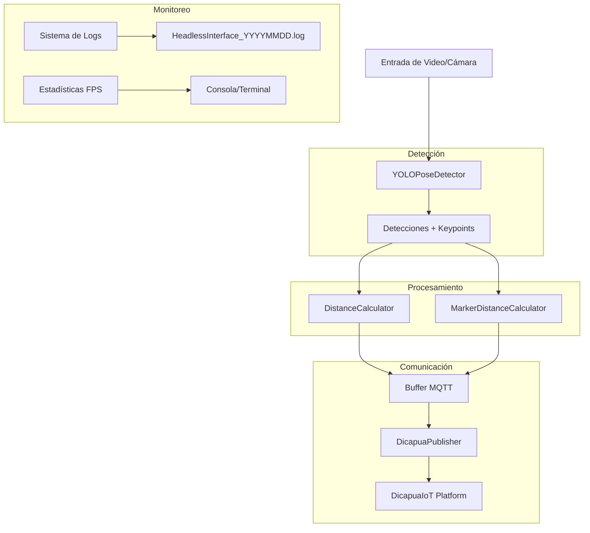

# Script `run_headless.py` - Detección Headless en Tiempo Real

## Descripción General

El script `run_headless.py` implementa un sistema de detección de objetos y poses en tiempo real sin interfaz gráfica (modo headless). Utiliza el modelo YOLO v8 para detección de poses, calculadores de distancia especializados y comunicación MQTT optimizada para transmisión de datos a la plataforma DicapuaIoT. 

## Arquitectura del Sistema Headless

### Componentes Principales



### Flujo de Procesamiento

1. **Inicialización**: Carga del modelo YOLO y configuración MQTT
2. **Captura de Video**: Adquisición continua de frames desde cámara/video
3. **Detección**: Identificación de objetos y keypoints con YOLO
4. **Cálculo de Distancias**: Procesamiento de métricas espaciales
5. **Buffer MQTT**: Agrupación optimizada de mensajes
6. **Transmisión**: Envío de datos a DicapuaIoT
7. **Monitoreo**: Logging y estadísticas en tiempo real

## Requisitos del Sistema

### Dependencias de Software

```bash
# Dependencias principales
opencv-python>=4.8.0
numpy>=1.24.0
PyYAML>=6.0
paho-mqtt>=1.6.0
ultralytics>=8.0.0  # Para YOLO v8
yt-dlp>=2023.7.6    # Para streaming de YouTube
```

### Sistemas Operativos Soportados

- ✅ Linux (Ubuntu 20.04+, CentOS 8+)
- ✅ Windows 10/11
- ✅ macOS 11+
- ✅ Docker containers

## Instalación y Configuración

### 1. Instalación de Dependencias

```bash
# Clonar repositorio
git clone <repository-url>
cd osi4iot-frame-iker-chavez

# Instalar dependencias
pip install -r requirements.txt

# Instalar dependencia adicional para YouTube (si no está en requirements.txt)
pip install yt-dlp

# Verificar instalación
python headless/run_headless.py --help

# Verificar soporte YouTube
python headless/run_headless.py --youtube-url "test" --verbose
```

### 2. Configuración MQTT

Crear archivo de configuración MQTT:

```json
# dicapuaiot/dicapuaiot.json
{
  "broker_host": "your-broker.dicapuaiot.com",
  "broker_port": 1883,
  "username": "your-username",
  "password": "your-password",
  "client_id": "headless-detector",
  "topics": {
    "data": "YOLOframe",
    "status": "system/status"
  }
}
```

### 3. Configuración del Modelo

Asegurar que el modelo YOLO esté disponible:

```bash
# Verificar modelo
ls models/best.pt
```

## Parámetros de Configuración

### Argumentos de Línea de Comandos

| Parámetro | Tipo | Defecto | Descripción |
|-----------|------|---------|-------------|
| `--camera-index, -c` | int/str | 0 | Índice de cámara o ruta de video |
| `--config` | str | config/config.yaml | Archivo de configuración |
| `--show-window, -w` | flag | False | Mostrar ventana de detección |
| `--confidence` | float | 0.5 | Umbral de confianza (0.0-1.0) |
| `--iou` | float | 0.45 | Umbral IoU para NMS (0.0-1.0) |
| `--verbose, -v` | flag | False | Modo verbose |
| `--list-cameras, -l` | flag | False | Listar cámaras disponibles |
| `--youtube-url` | str | None | URL de YouTube para streaming |
| `--use-youtube` | flag | False | Habilitar modo YouTube |


### Parámetros MQTT Optimizados

| Parámetro | Tipo | Defecto | Descripción |
|-----------|------|---------|-------------|
| `--mqtt-enabled` | flag | True | Habilitar MQTT |
| `--no-mqtt` | flag | False | Deshabilitar MQTT |
| `--mqtt-debug` | flag | False | Modo debug MQTT |
| `--mqtt-heartbeat` | int | 30 | Intervalo heartbeat (segundos) |
| `--mqtt-stats` | float | 0.5 | Intervalo estadísticas (segundos) - optimizado |
| `--mqtt-buffer-size` | int | 10 | Tamaño buffer MQTT |
| `--mqtt-buffer-flush` | float | 0.025 | Intervalo flush buffer (segundos) - baja latencia |
| `--mqtt-ultra-fast` | flag | False | Modo ultra-rápido: buffer 5, flush 10ms |
| `--mqtt-topic` | str | None | Topic personalizado |

### Parámetros de Visualización

| Parámetro | Tipo | Defecto | Descripción |
|-----------|------|---------|-------------|
| `--keypoints` | flag | True | Mostrar keypoints |
| `--no-keypoints` | flag | False | Ocultar keypoints |
| `--bboxes` | flag | True | Mostrar bounding boxes |
| `--no-bboxes` | flag | False | Ocultar bounding boxes |
| `--labels` | flag | True | Mostrar etiquetas |
| `--no-labels` | flag | False | Ocultar etiquetas |

## Ejemplos de Uso

### Uso Básico

```bash
# Ejecutar con cámara por defecto
python headless/run_headless.py

# Listar cámaras disponibles
python headless/run_headless.py --list-cameras

# Usar cámara específica
python headless/run_headless.py --camera-index 1
```

### Streaming de YouTube

```bash
# Usar stream de YouTube 
python headless/run_headless.py --youtube-url "https://www.youtube.com/watch?v=VIDEO_ID" 
```

### Configuración Avanzada

```bash
# Modo verbose con ventana de visualización
python headless/run_headless.py -c 0 -w -v

# Configurar umbrales de detección
python headless/run_headless.py --confidence 0.7 --iou 0.5
```

## Funcionalidades Avanzadas

### Soporte para Streaming de YouTube

El sistema ahora incluye soporte completo para streaming de YouTube:

- **Extracción automática de streams**: Utiliza `yt-dlp` para obtener URLs de video directas
- **Reconexión automática**: Manejo inteligente de desconexiones de stream
- **Modelo YOLO estándar**: Opción `--standard-yolo` para detectar objetos comunes (personas, vehículos, etc.)
- **Compatibilidad con URLs**: Soporte para URLs de YouTube en vivo y videos

### Sistema de Filtrado Inteligente

Implementa un sistema avanzado de filtrado de datos redundantes:

- **Detección de cambios**: Solo envía datos cuando hay variaciones significativas en distancia
- **Filtro de velocidad**: Evita envíos por movimientos menores a 0.2 cm/s
- **Estabilidad de posición**: Requiere 5 frames estables antes de enviar
- **Ventana temporal**: Análisis de ruido en ventana de 2 segundos
- **Umbral de distancia**: Cambios mínimos de 0.5cm para activar envío

## Optimizaciones de Rendimiento

### Sistema de Buffer MQTT

El script implementa un sistema de buffer optimizado que:

- **Agrupa mensajes**: Reduce overhead de red
- **Flush automático**: Envío cada 25ms por defecto (optimizado)
- **Modo ultra-rápido**: Buffer de 5 mensajes, flush cada 10ms
- **Control de tamaño**: Buffer configurable (10 mensajes por defecto)
- **Filtro de redundancia**: Evita envío de datos sin cambios significativos
- **Recuperación de errores**: Reconexión automática con backoff exponencial

### Métricas de Rendimiento

```python
# Ejemplo de salida en consola
[16:00:20] FPS: 9.6 | Detecciones: 2 | Total: 649 | MQTT: 🟢 | Tiempo: 29.9s
  └─ portico: 0.945
  └─ pulsador: 0.862
```

### Configuración de Intervalos

$$
\text{Latencia Total} = \text{Detección} + \text{Procesamiento} + \text{Buffer} + \text{Red}
$$

- **Detección**: ~50-100ms (dependiente de hardware)
- **Procesamiento**: ~10-20ms
- **Buffer**: 25ms por defecto, 10ms en modo ultra-rápido
- **Red**: Variable (dependiente de conexión)
- **Loop principal**: 1ms (optimizado para máxima responsividad)

### Nuevas Optimizaciones de Latencia

- **Intervalo de estadísticas MQTT**: Reducido de 1s a 0.5s
- **Buffer flush**: Optimizado de 100ms a 25ms
- **Modo ultra-rápido**: Buffer de 5 mensajes, flush cada 10ms
- **Filtro inteligente**: Evita envío de datos redundantes sin cambios significativos

## Monitoreo y Logging

### Sistema de Logs

Los logs se almacenan en:
```
headless/data/logs/HeadlessInterface_YYYYMMDD.log
```

**Ejemplo de log:**
```
2025-09-03 15:42:18,122 - HeadlessInterface - INFO - Interfaz headless inicializada
2025-09-03 15:42:58,059 - HeadlessInterface - INFO - Detección detenida
2025-09-03 15:42:58,476 - HeadlessInterface - INFO - Interfaz headless cerrada
```

### Estadísticas en Tiempo Real

- **FPS**: Frames por segundo procesados
- **Detecciones**: Objetos detectados por frame
- **Total**: Contador acumulativo
- **Estado MQTT**: 🟢 Conectado / 🔴 Desconectado
- **Tiempo**: Uptime del sistema

### Métricas MQTT

- **Mensajes enviados**: Contador de éxito
- **Mensajes fallidos**: Contador de errores
- **Intentos de conexión**: Reintentos automáticos
- **Tamaño de buffer**: Mensajes pendientes

## Manejo de Errores y Recuperación

### Reconexión Automática MQTT

```python
# Configuración de reintentos
max_retries = 5
retry_delay = 1  # segundos
max_delay = 5    # límite de delay exponencial
```

## Solución de Problemas

### Problemas Comunes

#### 1. Error de Cámara
```bash
❌ Error al abrir la fuente de video: 0
```
**Solución:**
- Verificar permisos de cámara
- Listar cámaras disponibles: `--list-cameras`
- Probar con índice diferente: `--camera-index 1`

#### 2. Error de Conexión MQTT
```bash
❌ Error MQTT (intento 1/5): Connection refused
```
**Solución:**
- Verificar configuración en `dicapuaiot/dicapuaiot.json`
- Comprobar conectividad de red
- Usar modo debug: `--mqtt-debug`

#### 3. Modelo YOLO No Encontrado
```bash
❌ Error al cargar el modelo YOLO
```
**Solución:**
- Verificar que existe `models/best.pt`
- Descargar modelo base si es necesario
- Comprobar permisos de lectura

#### 4. Error de YouTube Stream
```bash
❌ Error extrayendo stream de YouTube
```
**Solución:**
- Verificar que `yt-dlp` está instalado: `pip install yt-dlp`
- Comprobar que la URL de YouTube es válida
- Usar `--verbose` para ver detalles del error
- Probar con diferentes URLs de YouTube

#### 5. Latencia Alta en MQTT
```bash
📊 Stats: FPS=5.2 | Buffer: 15 msgs
```
**Solución:**
- Usar modo ultra-rápido: `--mqtt-ultra-fast`
- Reducir buffer: `--mqtt-buffer-size 5`
- Optimizar flush: `--mqtt-buffer-flush 0.01`
- Verificar conexión de red

### Comandos de Diagnóstico

```bash
# Verificar sistema
python headless/run_headless.py --list-cameras --verbose

# Prueba sin MQTT
python headless/run_headless.py --no-mqtt --show-window

# Debug completo
python headless/run_headless.py --mqtt-debug --verbose

# Prueba YouTube con modelo estándar
python headless/run_headless.py \
  --youtube-url "https://www.youtube.com/watch?v=dQw4w9WgXcQ" \
  --standard-yolo --no-mqtt --verbose

# Prueba optimizaciones MQTT
python headless/run_headless.py --mqtt-ultra-fast --mqtt-debug
```

## Desarrollo

### Estructura del Código

```
headless/
├── run_headless.py          # Script principal
├── data/
│   └── logs/               # Logs del sistema
└── README.md              
```


---

